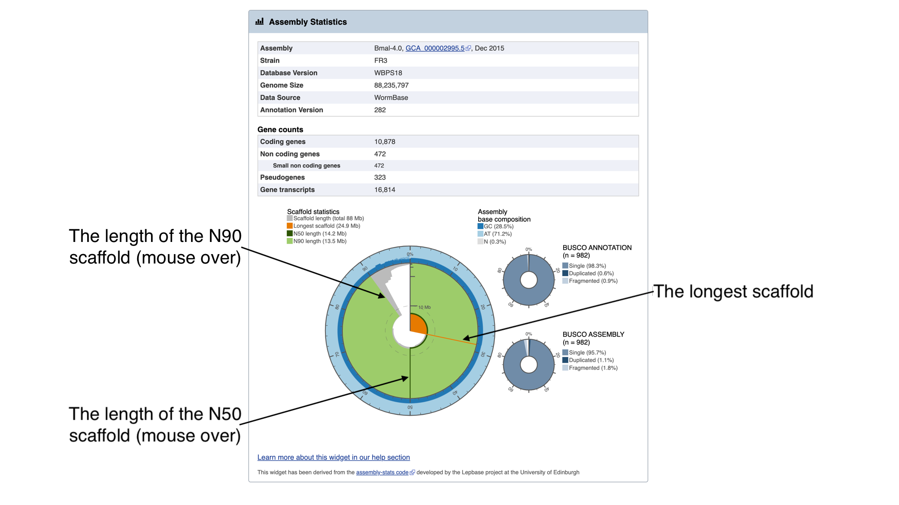
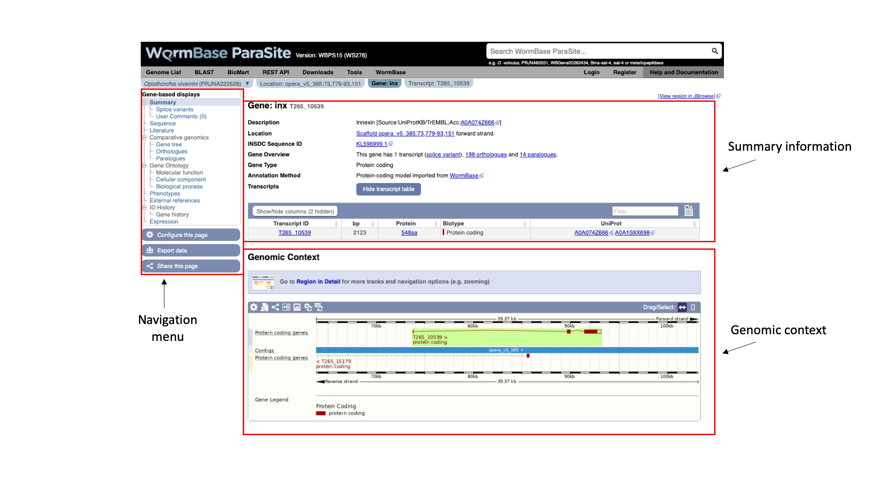
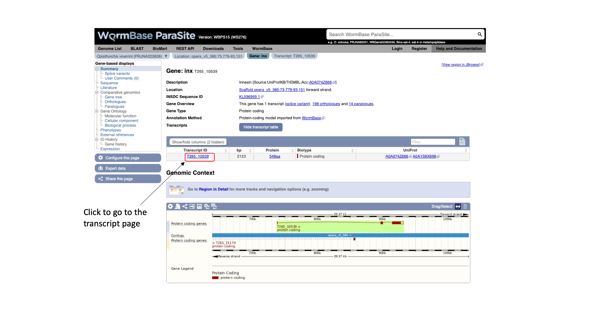
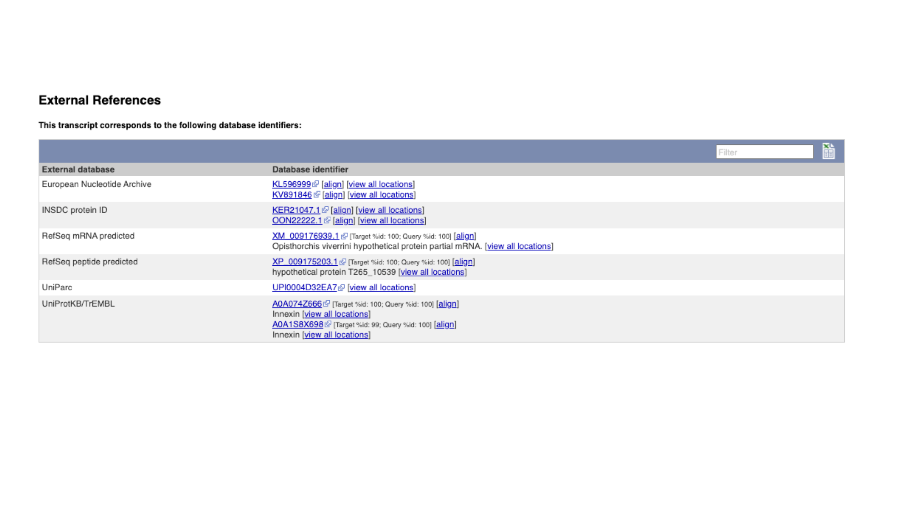
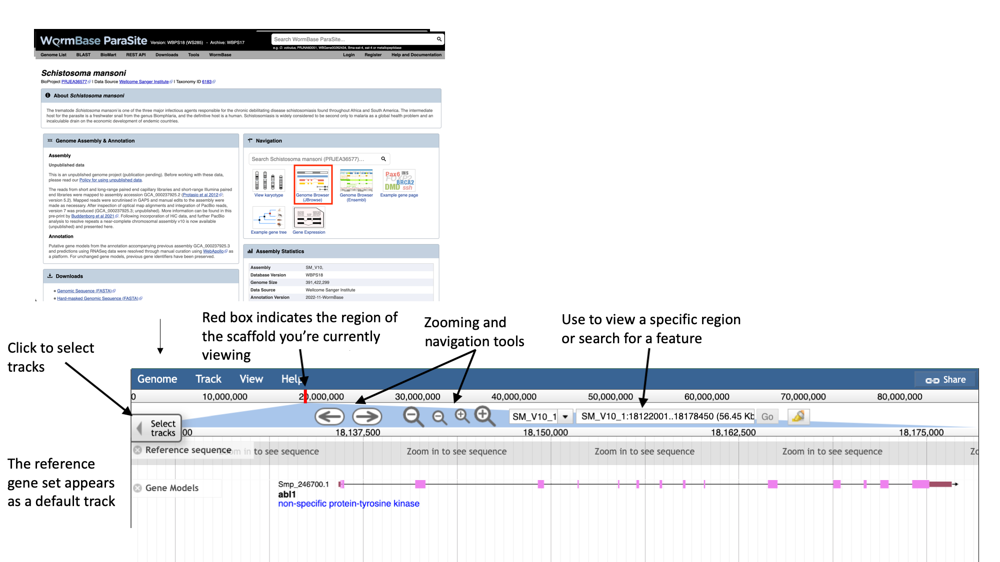

# WormBase ParaSite
Updated by Jose Tort (2025)

## Table of contents
1. [Overview and Aims](#intro)
2. [Genes and genomes](#genes_and_genomes)
    * [Genes: the basics](#basics_genes)
    * [Genomes: the basics](#basics_genomes)
    * [Sequence databases](#sequence_databases)
3. [Looking at genomes in WormBase ParaSite](#wbps_genomes)
    * [_EXERCISE 1_Genome assembly metrics_](#genomes_exercise)
    * [Submit a genome to WormBase ParaSite](#submit_genome)
4. [Looking at genes in WormBase ParaSite](#wbps_genes)
    * [The gene page](#gene_page)
    * [Functional annotation: protein domains and GO terms](#functional_annotation)
    * [Gene Ontology terms](#go_terms)
    * [Protein domains](#protein_domains)
    * [AlphaFold 3D protein structures](#af)
    * [Orthologues and paralogues](#comparative_genomics)
    * [_EXERCISE 2 - Gene page information retrival_](#gene_page_exercise)
5. [JBrowse](#genome_browser)
    * [Using JBrowse](#Jbrowse_basics)
    * [Tracks](#tracks)
    * [Motifs Search](#Motif_Search)
    * [Visualising your own data](#Data_Upload)

  

## Overview and Aims <a name="intro"></a>
In this first module we'll start by reviewing the basics on genes and genomes: what they are, how we represent and talk about them, and how we go from a DNA sequence- a string of letters- to making predictions about gene function. We'll look at this in the context of WormBase ParaSite (which you might also see referred to as WBPS) and other online database resources. 

In short, WormBase ParaSite gathers together nematode and flatworm genomes that have been assembled and annotated by the research community, adds additional analyses and makes these data available to the scientific community. We'll look at the kind of data you can retrieve, initially by exploring the website. In the last part of the module we'll introduce BioMart. This is a data-mining tool that allows you to retrieve WormBase ParaSite data in bulk.

---
## Genes and Genomes  <a name="genes_and_genomes"></a>

Throughout this course, we assume that you're familiar with genes and genomes. 

### Genes: the basics  <a name="basics_genes"></a>

A **gene** is a unit of the genome, a DNA sequence, that is transcribed into an RNA molecule, or a transcript. A gene's transcript may go on to be translated into a protein (in that case it is an mRNA), or it may have a role as a non-coding RNA. Examples of the latter include ribosomal RNAs (rRNA), transfer RNAs (tRNA) and microRNAs (miRNA).

In eukaryotes, most protein-coding genes comprise alternating **exons** and **introns** (some genes have a single exon), flanked by **untranslated regions** (UTRs). The exons constitute the parts of the gene that are translated into a polypeptide. Introns are transcribed but soon after excised and the final mature mRNA is formed by a 5’UTR, joined exons and a 3’UTR. A CAP and poly-A tail are added to the 5’ and 3’ ends respectively. These structures are essential to guarantee the molecular stability and downstream processing of the mRNAs.


This figure represents the steps that are needed to transform information encoded in the DNA into a polypeptide and eventually a functional protein. The starting information is encoded in the genome. A gene encodes, among other things, the transcription start and transcription end. These are the nucleotides from where an RNA copy of the DNA will be generated. This copy is the pre-mRNA which is formed by exons and introns. Maturation of the mRNA molecule happens as it is transcribed and involves the splicing (removal) of introns with the concomitant joining of exons, addition of a CAP at the 5’ end and a polyadenylation tail (many As - AAAAAAA) at the 3’end. A processed mRNA will be the template for the translation of the mRNA message into a protein by the ribosome.

---
### Genomes: the basics  <a name="basics_genomes"></a>

A **genome** is an organism’s complete set of genetic material. Although every individual's genome is unique, the genomes of individuals of the same species will be very similar. It is useful to have a representative genome sequence for each species, and this is referred to as a reference genome. 

In the cell, genomes are organised into chromosomes. In practice, current DNA sequencing methods are unable to read the DNA sequence of a whole chromosome without errors. We therefore use the technique of sequencing shorter segments of chromosomes, and do it in such a way that the segments overlap and can be pieced together like a jigsaw puzzle. This process is referred to as genome assembly. For now, we will focus on what genome assemblies look like, and how they are represented in genome databases. 

The diagram below shows the structure of a typical assembly. It has 3 layers: the contigs are stretches of contiguous DNA sequence without gaps. The scaffolds are ordered sets of contigs separated by gaps of estimated length. In order to make scaffolds from contigs, techniques such as optical mapping and Hi-C are used. Finally, the chromosome is an ordered set of scaffolds separated by gaps on unknown length. To make the chromosome sequence from the scaffold, techniques such linkage mapping and FISH are used.


Sometimes, there is insufficient (or no) data to reliably place a scaffold into a specific position on a chromosome. In the figure above, this is true of the scaffold on the right. The assembly above therefore comprises 2 toplevel sequences: 1 chromosome, and one unplaced scaffold.

---
### Sequence databases <a name="sequence_databases"></a>

Over the last few decades, as technology has evolved, we've seen an explosion in the number of genes and, later, genomes that have been sequenced. Sequence databases provide a place where these sequences can be deposited, stored and made available to the world. There are three widely-used nucleotide repositories (or primary databases) for the submission of nucleotide and genome sequences:

* [GenBank](https://www.ncbi.nlm.nih.gov/genbank), hosted by the National Center for Biotechnology Information (or NCBI).
* The [European Nucleotide Archive (ENA)](http://www.ebi.ac.uk/ena), hosted by the European Molecular Biology Laboratories (EMBL).
* The [DNA Data Bank of Japan (DDBJ)](http://www.ddbj.nig.ac.jp),  hosted by the National Centre for Genetics.

Together they form the [International Nucleotide Sequence Database Collaboration](http://www.insdc.org/about) and luckily for users, they all “mirror” each other. This means that irrespective of where a sequence is submitted, the entry will appear in all three databases. Once data are deposited in primary databases, they can be accessed freely by anyone around the world.

WormBase ParaSite takes sequencing data from INSDC (a genome assembly and a set of gene predictions) and adds additional value to the data by performing additional analyses. The data is being available to researchers in a user-friendly interactive way. In this part of the module we will explore the basic functionality of the website for looking at helminth genomes and genes.

[↥ **Back to top**](#top)

---
## Looking at genomes in WormBase ParaSite <a name="wbps_genomes"></a>

WormBase ParaSite is a collection of genomes from different nematodes and platyhelminthes!

In this section, we’ll explore how genome assemblies are presented in WormBase ParaSite, and look at some commonly used metrics of assembly quality.

Earlier, we introduced the idea that a genome assembly is constructed from shorter segments of sequence, pieced back together in the right order. In an ideal world the assembly would be constructed back into chromosomes. Many of the genomes in WormBase ParaSite are much more fragmented than this; this means that a chromsome might actually be represented by hundreds or even thousands of smaller stretches of sequence (scaffolds or contigs). Having a more fragmented genome makes identifying genes much more challenging, as gene models are more likely to be split across scaffolds. 

1. From the WormBase ParaSite homepage, click either the ”Genome List” tab in the tools bar, or the “Genomes” icon.


This will take you to a list of all of the genomes currently available in WormBase ParaSite, divided phylogenetically into the phyla *Nematoda* and  *Platyhelminthes*.

Table Features:

- **Species with multiple entries**: You might notice that some species (like _Ancylostoma ceylanicum_ in the figure below) have two entries: this is because the research community has produced two different reference assemblies for these genomes, and WormBase ParaSite makes them both available.
- **Link to the sequence archive**: In this table you can also find a link to the sequence archive where the genome sequence was originally deposited (‘BioProject ID’).
- **Links to two different genomes browsers**, JBrowse and Ensembl. We’ll cover the use of genome browsers to visualise genomes later.
- **Genomes statistics**: The ‘BUSCO ASSEMBLY’, ‘BUSCO ANNOTATION’ and ‘N50’ columns give some statistics about the quality of the genome assembly. More statistics can be loaded by using the "Show/hide" columns drop-down menu at the top of the table. We will cover exactly what these values mean below.
- **Sortable/Searchable**: You can sort the tables based on any column including the columns showing genomes' statistics (For example sort the columns from the highest to the lowest N50 value). You can also use the top-right "Filter" text box to search any column.


2. Scroll down the page to find _Brugia malayi_ and click the species name link- this will take you to the _B. malayi_ genome landing page.


The genome page has useful summary information about the species and the assembly. You can see a summary of the methods used to produce the assembly and the annotation, and links to the publication describing it in more detail (where this is available).
3. Look now at the ‘Assembly statistics’ box.



The information in this box tells us about two metrics related to the quality of the assembly: contiguity and completeness.<br>
- **Contiguity** describes how many scaffolds a genome is represented by: in a perfectly contiguous reference genome, the number of scaffolds would be equal to the number of chromosomes. Contiguity is described by several values, including the total number of scaffolds in the assembly, the length of the longest scaffold, the N50 length and the N90 length. If all of the scaffolds of the assembly were lined up in order of longest to shortest, the N50 length is the length of the scaffold at the midpoint. Similarly, the N90 length is the length of the scaffold at the 90th percentile. For a given genome, a larger N50 length and N90 length generally indicate a more contiguous assembly. 
   <br>
   <br>
   In the “Assembly statistics” widget, the circumference of the circle represents the whole genome assembly, with scaffolds ordered from longest to shortest. The diameter of the grey colour represents the length of the scaffold represented at each point of the circle. The light grey shading represents the N90 scaffold, whilst the dark grey shading represents the N50 scaffold. The light blue outer ring shows the GC/AT/N percentage of the scaffold.
   <br>
   <br>
   Mouse over the widget to explore the number of scaffolds contributing to the genome. You should see that the N50 length (14.2 Mb) is the third longest scaffold, and the N90 length (13.5 Mb) is the fifth longest scaffold.
   <br>
   <br>
- **Completeness**: BUSCO is a method of assessing genome completeness based on the principle that some genes are so highly conserved across eukaryotic species that they should be present in any genome assembly, in single copy. Generally speaking, a higher percentage of single BUSCO genes, indicates a higher quality assembly. BUSCO ASSEMBLY does not take account the genome's provided gene models, assessing the assembly quality of a genome by predicting a gene-set ab initio using AUGUSTUS. BUSCO ANNOTATION, on the other hand, is running at the protein level, assessing not only the assembly quality of a genome but also the quality of its annotation.
    <br>
    <br>
    A word of warning though: BUSCO scores can be misleading for certain taxonomic groups. Although the genes are selected because they are supposed to be universally conserved, this is not always the case. Platyhelminth genomes tend to have lowerBUSCO scores; this is not necessarily because the genomes are lower quality, but because some highly conserved eukaryotic genes are truly absent from this group of organisms.
<br><br>

---
### _EXERCISE 1 - Genome assembly metrics_ <a name="genomes_exercise"></a>

1. Find the two other genome assemblies from different _Brugia_ species in WormBase ParaSite, which are of lower quality than _Brugia malayi_.
   
3. According to their scaffold statistics and BUSCO scores, which of these two assemblies is more contiguous and complete?

---
#### How to submit a genome to WormBase ParaSite? <a name="submit_genome"></a>

Let's say you have just finished working on a genome project and you would like to submit it to WormBase ParaSite. WBPS takes sequencing data from INSDC (a genome assembly and a set of gene predictions).

If you are interested in including your newly sequenced genome to WBPS you need to:

1) Make sure to first submit the genome assembly to the INSDC either through [ENA](https://ena-docs.readthedocs.io/en/latest/submit/assembly.html), [NCBI](https://www.ncbi.nlm.nih.gov/assembly/docs/submission/) or [DDBJ](https://www.ddbj.nig.ac.jp/ddbj/submission-e.html).<br><br>INSDC stores both primary data (i.e. the sequence reads exactly as they come off the machine) and assembled genomes (i.e. where an assembly algorithm has been used to build scaffolds or chromosomes from those reads). Commonly, these data are all stored together under what's known as a **BioProject**. Each BioProject is identified by an **accession**. Although every BioProject accession is a unique identifier for that project, they all start with a 5-letter code that denotes which INSDC database the data were submitted to: "PRJEB" for ENA, "PRJNA" for GenBank, and "PRJDB" for DDBJ. The **BioProject** assigned to each genome deposited in WBPS can be accessed in the genomes table or through a link below below the species name in each species genome page.<br><br>An AGP file is often also provided, describing how the contigs fit together as scaffolds, and how the scaffolds fit together as chromosomes.<br><br> 

2) Submit the gene models annotation file in GFF format (more on this file format later).<br><br>A genome project may also contain an annotation file. This file contains predicted gene structures: based on the genome sequence, certain algorithms can predict which regions encode genes. An example of a commonly-used gene prediction tools is [BRAKER](https://github.com/Gaius-Augustus/BRAKER). These predictions may or may not be guided by other types of evidence, such as RNA sequencing data. It is important to bear in mind that the majority of genes as they appear in the sequence databases (and also in WormBase ParaSite) are based on predictions: these predictions are driven by evidence, but most genes from helminth genome assemblies are unlikely to have been cloned and sequenced in their entirety. We'll look at an example of checking how well a gene model is supported by RNAseq evidence in the next WormBase ParaSite module. The gene models annotation file can either be submitted to the INSDC as part of the assembly submission or directly to us.

[↥ **Back to top**](#top)

---
## Looking at genes in WormBase ParaSite <a name="wbps_genes"></a>
For each genome in WormBase ParaSite, there are gene and transcript pages available for browsing. The aim of this section is to familiarise you with retrieving information about a gene of interest from WormBase ParaSite.

### The Gene Page <a name="gene_page"></a>
We will use a walk through example to illustrate how to use the website to find out about the function of an _Opisthorcis viverrini_ gene.

#### Basic Navigation
1. Open up a web browser, and type this URL into the address bar: https://parasite.wormbase.org/

The page should look something like this:

  

2. Paste "T265_10539" into the search bar in the top right of the page and click return. T265_10539 is a gene stable ID. These identifiers are allocated by the scientist or group that sequenced and annotated the genome.

  

You should get one result, matching a gene in *Opisthorchis viverrini*, the Southeast Asian Liver Fluke. Let's look at the page for the T265_10539 gene:

3. Click T265_10539

Every gene in WormBase ParaSite has a gene page, which presents sequence data and a summary of information from various sources about the gene.



The gene page has three main sections. In the summary section, together with the description of our gene we can also see the genomic location of the gene ("opera_v5_385", in this case) and the INSDC Sequence ID. This is an identifier that links to an entry for the scaffold in ENA.

Underneath, we can see some information about the gene: it has one transcript isoform and a number of orthologues and paralogues. We’ll revisit this later. We can also see that the gene is protein-coding.

On the left, we have a navigation menu, which can be used to explore the information that is available for each gene. We’ll be going through each of these menu options in turn.

The “Genomic context” image underneath shows us a snapshot of the scaffold that our gene is on.

4. Click the ‘Region in Detail’ link in the “Genomic context” section. <a name="genome_browser"></a>


Here, each of the three boxes gives us an increasingly zoomed-in view of the gene’s genomic position. The top box shows the whole scaffold, and the middle box below it shows a zoomed-in part of the scaffold. In this case, the scaffold ("opera_v5_385") is short so the middle box is showing the whole scaffold. Looking at the middle box, it shows us that out gene of interest is located approximately a quarter of the way along the scaffold. The bottom box shows us the structure of the gene model.

We can see that:

- The gene is on the forward strand - you can see this from the ‘>’ symbol located next to the gene name in the protein coding genes track.
- The gene has three exons in total, of which 2 contain coding sequence. Both 5' and 3' UTRs (untranslated regions) are annotated.

You can learn more about the Genome Browser [here](https://parasite.wormbase.org/info/Browsing/genome_browser_ensembl.html).

<details closed>
<summary>Sneak peek</summary>
There is an alternative interactive Genome Browser in WormBase ParaSite that can be accessed by the "View region in Jbrowse" button at the top-right of the gene page but we're going to talk about it in our next module!
</details>

5. Navigate back to the gene page by clicking the "Gene:inx" tab at the top of the page. 

As well as gene pages, WormBase ParaSite has a page for each transcript that a gene produces. In this case, only one transcript isoform has been annotated.

6. On the gene page, click the "Show transcript table" button to show the trancript table. Then click the transcript ID in the transcipt table to navigate to the transcript page.




Notice that there are different tabs to rapidly jump from the genomic context, gene info or transcripts information. 

The navigation menu of the left hand side of the page, automatically updates with information available for each level.

Again using the navigation menu on the left hand side of the page, we can retrieve three main types of information on the transcript: sequences, information about the protein domains, and external references.


7. Click “Exons”, “cDNA” and “Protein” in the “Sequence” section of the navigation menu to see the different types of sequence that are available for the transcript.


- The “Exons” tab displays the sequence of individual exons in a table (useful if you’re interested in retrieving, say, only the sequence of exon 2). 
- The “cDNA” tab has the cDNA sequence (the sequence you would get if you reverse transcribed mature mRNA).
- The “Protein” tab has the amino acid sequence. All of the sequences can be downloaded in FASTA format - this is a text format that is widely used for representing sequences. It consists of a header line (a “>” character and a description or name of the sequence) followed by the sequence itself on the next line. As well as the sequences displayed in the browser, you can also choose to download, for example, genomic sequence, just UTRs etc.

Many users use sequences retrieved from these pages to design primers.


Note that this protein sequence is what is known as a conceptual translation: the amino acids have not been sequenced directly, but we can infer the sequence given the predicted structure of the gene (the coordinates of the introns and exons), the underlying DNA sequence and a given codon usage table.

[↥ **Back to top**](#top)

---
#### Functional annotation: Gene Ontology (GO) terms, protein domains and protein structure <a name="functional_annotation"></a>

So far we have gathered general information about this _Opisthorcis viverrini_ gene. We have also inspected their genomic location and sequence.
However, we don't have any clues about the genes' function! What does the protein encoded from this gene do?


##### Gene ontology (GO) <a name="go_terms"></a>

A fast way to find out about the function of a gene’s product is to see which **Gene Ontology** (GO) terms have been associated with it. GO is a project that seeks to describe complex biology in a logical, hierarchical and computer-processable way. It is a controlled vocabulary, whereby proteins are associated with GO terms that describe their function. There are three aspects to GO: Cellular Component, Molecular Function and Biological Process. Cellular Component GO terms describe where a protein is localised (in the membrane, extracellular, in the nucleus etc). Molecular Function GO terms describe the biochemical activity of the protein. Biological Process GO terms describe the pathways and broader processes that the protein contributes to.

1. Click the “Gene:inx” tab at the top of the page to return to the main gene page, then select "Biological process" and/or “Cellular component” from the Gene Ontology section of the left navigation menu.


WormBase ParaSite imports GO annotations from three sources:
- Terms assigned by UniProt
- Terms inferred by the protein’s InterPro domains (more about this in the next section)
- Terms that have been associated with orthologues of the gene of interest.

The GO terms associated with this gene make sense given what we already know about the Innexin protein family: this protein likely forms part of the gap junction, which is a channel connecting the cytoplasm of two cells.

---
##### Protein Features and Domains <a name="protein_domains"></a>

How we do go from a string of amino acids to predicting what this protein might do in the cell? 
This is where another type of database comes in: **protein family databases**. 

For the vast majority of predicted protein sequences, nobody will have done experiments to test what its function is. However, we can use the principle of **homology** to take proteins that are well-studied in one experimental system and infer that proteins of similar sequence in other organisms are likely to have similar structure, and therefore similar function.

In reality, protein sequences are analysed in terms of **domains**: these are subsequences of a protein that have a defined tertiary structure or sequence motif, conferring a defined function. A protein can consist of several domains. When comparing proteins between organisms, often the region encoding a protein domain is highly conserved whilst the bit that connects different domains together is more divergent.

**The [InterPro](https://www.ebi.ac.uk/interpro/) consortium**: There are many protein domain databases. A well known example of a protein domain database is Pfam. Pfam uses multiple sequence alignments of the known proteins with a certain domain to capture a representative model (a profile Hidden Markov Model) of that domain. Other protein domain databases, that might use slightly different methods to define domains, are:  CATH, CDD, HAMAP, MobiDB Lite, Panther, PIRSF, PRINTS, Prosite, SFLD, SMART, SUPERFAMILY and TIGRfams. Luckily for us, all of these databases are united under the [InterPro](https://www.ebi.ac.uk/interpro/) consortium.


InterPro provides a tool, [InterProScan](https://www.ebi.ac.uk/interpro/search/sequence/), that we can use to search protein sequences against all of the member databases to identify any protein domains that the protein might have:
InterProScan is an extremely useful tool for predicting gene and protein function.

**At WormBase ParaSite, we have pre-run InterProScan to annotate protein domains for all of the genes in our database so you don't have to do it yourself every time!**

1. To view the annotated protein domains, click the “Protein summary” menu option in the navigation menu on the T265_10539 transcript page.

On this page we see a pictorial representation of the protein domains that have been annotated to this polypeptide.  We can see here that this protein has a match with an Innexin domain in several protein domain databases, and four transmembrane helices.


2. The same data is available in tabular format. To view this format, click the “Domains & features” menu option.


<details close>
<summary>How to explore the protein domains of a protein that is not available in WormBase ParaSite?</summary>

* Go to the [Interpro Search page](https://www.ebi.ac.uk/interpro/search/sequence/), paste your protein sequence into the box and click search.

You may need to wait a few minutes for the search to run.


On the results page, each horizontal coloured line represents a match between our protein sequence and a domain or motif in one of the InterPro member databases. Mouse over these, to get more information. InterPro groups the same domain represented in different databases under a single InterPro accession.

* Click through to read more about the annotated protein family on the Interpro site.
</details>

---
##### Protein Structure: Explore the 3D protein model of the gene using AlphaFold <a name="af"></a>

Knowledge of protein's 3D structure is a huge hint for understanding how the protein works, and use that information for different purposes; control or modify protein's function, predict what molecules bind to that protein and understand various biological interactions, assist drug discovery or even design our own proteins.

Protein structure prediction is the inference of the three-dimensional structure of a protein from its amino acid sequence—that is, the prediction of its secondary and tertiary structure from primary structure.

Predicting the 3D structure of proteins is one of the fundamental grand challenges in biology. By solving this challenge, we can dramatically deepen our understanding of human health, disease, and our environment, especially within areas like drug design and sustainability.


[AlphaFold](https://alphafold.ebi.ac.uk/), the state-of-the-art AI system developed by [DeepMind](https://www.deepmind.com/), is able to computationally predict protein structures with unprecedented accuracy and speed. Working in partnership with [EMBL’s European Bioinformatics Institute (EMBL-EBI)](https://www.ebi.ac.uk/), AlphaFold released over 200 million protein structure predictions that are freely and openly available to the global scientific community. Included are nearly all catalogued proteins known to science – with the potential to increase humanity’s understanding of biology by orders of magnitude.

WormBase ParaSite has imported all AlphaFold predicted models available for its genes.

1. AlphaFold predicted model is browsable from the transcript page. To view the model click the “AlphaFold predicted model” menu option in the left navigation menu on the T265_10539 transcript page.


You can now view the shiny new interactive 3D AlphaFold structure of the protein. The interactive molecular viewer visualizes the structure, coloured by the per-residue pLDDT confidence measure. 

Drag and drop with your mouse over the protein model to rotate it and use your mouse wheel to zoom in/out. You can use the right panel to visualise exons as well protein domains and features on the 3D model (toggle the eye or + symbol to view options). This might give you a better understanding of where your domains of interest are. 

<details close>
<summary>What can I do with an AlphaFold protein structure?</summary>

To download the raw files for an AlphaFold protein structure you found in WormBase ParaSite:
1. Take a note of the AlphaFold accession ID, in our case it's: AF-A0A074Z666-F1
2. Go to the AlphaFold web-page and search for it (https://alphafold.ebi.ac.uk/entry/A0A074Z666).
3. At the top of the page you can downlaod the prediction in PDF, mmCIF or Predicted Align Error format. 

Then you could use the structure file to perform subsequent analyses. Online tools that can be used with the downloaded structures from AlphaFold:

- [SwissDock](http://www.swissdock.ch/), a web service to predict the molecular interactions that may occur between a target protein and a small molecule.
  It is used alongside S3DB, a database of manually curated target and ligand structures, inspired by the Ligand-Protein Database. 

- [SwissModel](http://www.swissmodel.expasy.org/), a fully automated protein structure homology-modelling server, accessible via the Expasy web server.
  It allows to generate novel homology models, generate structural overlaps, and annotate them.

- [Zhang group Online-serivces portal](https://zhanggroup.org/)
  - Docking simulations (https://zhanggroup.org/EDock/) against different ligands.
  - Protein structure alignment with another protein (https://zhanggroup.org/TM-align/).
</details>

[↥ **Back to top**](#top)

---
#### From WormBase ParaSite to the world: External References

External references are the identifiers by which the gene (or transcript or protein, in this case) is known in other databases outside WormBase ParaSite.

These usually include RefSeq (the reference sequence database of the NCBI) and UniProt, and sometimes (though not in this case), WormBase ParaSite’s sister database, WormBase.

* Click “External References” in the navigation menu.



[↥ **Back to top**](#top)

---
#### Comparative genomics <a name="comparative_genomics"></a>

Another approach to understanding what a gene does is comparing its sequence to other genes, both within the same genome, and across different genomes.

WormBase ParaSite groups all helminth genes, together with comparator genes from a number of model organisms, into families, based on the similarity of their protein sequences.

For each family, we arrange the genes into an evolutionary tree. 

1. Go back to the gene page tab and select “Gene tree” from the Comparative Genomics section of the left navigation menu.


The gene tree shows the inferred evolutionary history of the family that this gene is a member of.

- End of branches: At the ends of the branches are genes, with our gene of interest highlighted in red. 
- Nodes: The points where the branches split are called nodes; nodes represent different evolutionary events, with these being represented in the tree by different colours.
  - Dark blue nodes represent speciation events (where two populations of an existing species diverged into two new species).
  - Red nodes represent duplications, where within the genome of one species a gene underwent a duplication.
  - Turquoise nodes represent ambiguity, i.e. there was no clear evidence for marking the node as either a speciation or duplication event. 

Note that the most closely related gene in the tree is from another _Opisthorchis_ species, _O. felineus_, these two genes are orthologous to each other.

- **Orthologues** are genes that evolved from a common ancestral gene by speciation; they may have diverged to a greater or lesser degree in their sequences, but often retain their function in their respective species.
- **Paralogues** are genes that have evolved from a common ancestral gene by duplication.

**It can be useful to look at alignments of these related proteins to see how well conserved they are. Highly conserved regions are more likely to be essential for the function of the protein. To do this:**

1. Click on the section of the tree labelled “Blood flukes" and click “expand this subtree”.

Next to the main tree, in green, we can see a pictorial summary of the multiple alignment of the proteins of these four genes, with green coloured regions representing alignments and non-coloured regions representing gaps. You may be interested in exploring these alignments at a higher resolution.

* Click the node that separates the _Opisthorchis sp._ from the Blood Flukes and then click "View in Wasabi" in the pop-up box.

A multiple alignment of the 25  proteins will appear in a new window: we can see that parts of these protein sequences are extremely well conserved. 


Orthologues and paralogues are also available in tabular format, where they can be easily exported.

* Select “Orthologues” in the navigation menu.


In the main table on this page, each row represents an orthologue of *inx*. The table gives details on the nature of the relationship between our *O. viverrini* gene and the gene in the other species, such as whether the gene has one or multiple orthologues in the other species (1-to-1 or 1-to-many), and how similar the two proteins are. Multiple alignments can be viewed by following the links.

[↥ **Back to top**](#top)

#### WormBase ParaSite Gene Trees: technical overview <a name="compara"></a>

WormBase ParaSite uses a computational pipeline developed by the [Ensembl](https://www.ensembl.org) project to group related genes into families and define the evolutionary relationships between them. Below is a summary of the steps of the pipeline:
1. A library of protein family Hidden Markov Models (HMMs) is used as a starting point. Gene sequences are scored against these models, giving a probability of how likely each sequence is to be a member of the corresponding family. The HMM library used in the Compara pipeline is based on the [Panther](http://www.pantherdb.org/) and [TreeFam](http://www.treefam.org/) databases.
2. Any proteins that were not classified into a family in the HMM search are then compared with each other by all-against-all BLAST.
3. Any family with more than 400 members is broken down into smaller families (max 400 proteins).
4. All of the protein sequences in each family are aligned against each other using efficient multiple alignment software.
5. For each family, a phylogenetic tree is built (using TreeBeST5). Tree building is guided by a species phylogenetic tree.
6. Orthologues and paralogues are called on the basis of the resulting tree: any two genes separated by speciation events are orthologs, and any two genes in the same species separated by a duplication event are paralogues.

You can read more about this pipeline [here](http://www.ensembl.org/info/genome/compara/homology_method.html).

[↥ **Back to top**](#top)

### _EXERCISE 2 - Gene page information retrival_ <a name="gene_page_exercise"></a>

The aim of this exercise is to familiarise yourself with the WormBase ParaSite gene page.
Go to the gene page for the _Trichuris muris_ gene TMUE_2000008757 and retrieve the following information:
1. What is the summary description of the gene? Do you have any idea what the gene might be doing from this description?
2. How many transcripts of the gene are annotated?
3. Which strand is the gene on? What is the name of the 5’ neighbouring gene?
4. Download the 3’UTR sequence.
5. What identifier would you use to search for the gene in Uniprot?
6. Where is this gene’s protein predicted to localise to?
7. Which Pfam domains is the protein predicted to have? Which of these is responsible for its DNA binding activity?
8. Download the protein alignment of TMUE_2000008757 and its _C. elegans_ orthologue. Is there any published literature on the _C. elegans_ orthologue?
   <details closed><summary>Hint</summary>Follow the link to the WormBase ParaSite page for the _C. elegans_ orthologue and look in the “Literature” tab.</details>
9. Are there any phenotypes associated with this _T. muris_ gene according to the gene page? Which one(s)? Where are these gene-phenotype associations inferred from?
    <details closed><summary>Hint</summary>Go back to the TMUE_2000008757 gene page and look in the "Phenotypes" tab.</details>
[↥ **Back to top**](#top)

---
## JBROWSE - The genome browser <a name="genome_browser"></a>

A genome browser is a tool that allows you to visualise a genome assembly and its features, together with experimental data aligned to the genome.

There are several commonly used genome browsers in bioinformatics, each with different features. In WormBase ParaSite we have two:

* Ensembl - this can be used to browse a large catalog of genomes across the tree of life. WormBase ParaSite has an instance of the Ensembl browser built in, and [we explored it in Module 1](https://github.com/WCSCourses/HelminthBioinformatics_2023/blob/main/manuals/module_1_WBP1/module_1_WBP1.md#genome_browser). 

* [JBrowse 1](https://jbrowse.org/jbrowse1.html) - this is the genome browser that we’ll be using today. WormBase ParaSite has an instance of JBrowse for every genome that it hosts. The Apollo project is a well known extension of JBrowse, which, like Artemis, can be used to edit gene models.

There are many other genome browsers for different needs out there. Feel free to explore them at your own time: [Integrative Genomics Viewer (IGV)](https://igv.org/),[UCSC Genome Browser](https://genome.ucsc.edu/),[Artemis/Artemis Comparison Tool (ACT)](https://www.sanger.ac.uk/tool/artemis-comparison-tool-act/) and the new version of Jbrowse: [Jbrowse 2](https://jbrowse.org/jb2/) 

### Using JBrowse: basic functionality <a name="Jbrowse_basics"></a>

In this example we’ll introduce the basic functionality of WormBase ParaSite's JBrowse 1, and demonstrate how to use the various tracks.

1. Navigate to the _S. mansoni_ genome page and select the “Genome Browser (JBrowse)” icon.



- Each scaffold is represented from its 5-prime end to its 3-prime end (relative to the forward strand).
- You can navigate to different scaffolds using the drop down menu in the middle of the screen, or by typing coordinates into the text box.
- Different types of data aligned to the genome are represented as tracks. When you first open JBrowse, one track will be on by default: the reference gene set.

For this example, we’ll consider that you’re interested in the gene Smp_312440.

2. Start by typing the identifier into the search box and clicking “Go” to navigate to the gene. 
3. Zoom in by clicking the large magnifying glass with a “+” symbol until the reference sequence resolves.


Here, you can see the forward and reverse DNA strands, together with the six possible translational reading frames (3 forward and 3 reverse).

4. Zoom out again so that you have the whole gene model in your field of view.
5. To extract sequence information about the gene, click the gene model such that a dialogue box pops up.


Scrolling down the content of the box, you can extract genomic or cDNA sequence, or the sequence of specific subfeatures (specific exons or UTRs, for example).

Alternatively, you may wish to extract the genomic sequence of a whole region:

6. Click the arrow next to the “Reference sequence” track label in the top left of the screen, select “Save track data”, then download the sequence as a FASTA
file.


### Visualizing data on Tracks  <a name="tracks"></a>

We can also use JBrowse to view other types of data aligned to the genome. 

7. Click the “select tracks” button in the top left of the screen.


For most species, in addition to the gene model (“Genome Annotation”) track, there are two additional main types of track:

- Repeat regions tracks - repetitive regions of the genome are annotated as part of WormBase ParaSite’s production process. 
- RNASeq tracks - WormBase ParaSite has a process of finding and aligning RNASeq data in the sequencing archives for our species of interest. These can be useful, for example, for checking that a gene model is well supported by expression data, or seeing in which life stages, or under which conditions, a gene of interest is transcribed. 
  - For species with a lot of publicly available RNA-Seq data, such as _S. mansoni_, the easiest way to explore the samples that are available is by using the facets on the left hand side. The samples are organised by their metadata.

Let’s say you want to see in which life stages Smp_312440 is expressed:

8. Click the “developmental stage” facet 
9. Select a few of the available libraries (in the example below we've selected 3h schistosomules and miracidia) and click “back to browser”.


- Each track represents a different sequencing library, and shows the number of reads that have been aligned at each position. 
- By mousing over the histogram, you can see the exact number of aligned reads at each base. 
- We can see that a lot of the tracks show biological replicates of the same condition.- We can use combination tracks to combine replicate tracks “on the fly”, so we use up less space on the screen.

* In the main menu at the top of the page, select “Track” and “Add combination track”.

A new empty track should appear. You can then drag and drop existing tracks in to combine them. When you add additional tracks, a dialogue box should appear for you to select the type of operation to use to combine them. For this example, we’ll choose “addition”: you’ll now see the total number of reads across both selected libraries that aligned at each region. Note that different set operations can be performed, including subtraction, multiplication and division; these might make sense depending on the tracks that are being combined and the information that you’re interested in.


As well as seeing that Smp_312440 is expressed in these conditions, we can use the coverage histograms to assess the quality of the gene model. Most parasitic worm genomes are annotated with automated pipelines. Whilst annotation algorithms can often be very accurate, they are not infallible. Most of the gene models that you look at in WormBase ParaSite will not have been checked by a human curator, so it is wise not to take them as “truth" unless you verify that they agree with any evidence that is available.


In this case we can see that each of the exons in the gene model have got good RNASeq coverage, with no additional exons suggested by the RNASeq data.


### Motif searching  <a name="Motif_Search"></a>

It might be useful to have a quick, visual way of showing where certain motifs (short, defined DNA sequences) are found in the reference sequence. JBrowse offers a quick and flexible way to do this. We’ll demonstrate this by generating a track for the TATA box sequence (a sequence found in the promoter region of many eukaryotic genes). The consensus TATA sequence is TATA[A/T]A[A/T] (where [A/T] indicates that either A or T could be present at that position).

* In JBrowse, select “Track” from the main menu bar, followed by “Add sequence search track”.
* Type the motif that we’re searching for in the dialogue box, in this format: TATA[AT]A[AT], and tick “Treat as regular expression”. This means that the [AT] section of the motif will be interpreted as a regular expression (ie, the base in this position can be either A or T). Click “Search”.


Going back to the main JBrowse window, a new track has appeared with all instances of the motif marked. Zooming in to the 5-prime end of Smp_312440, we can see that one of these is well positioned to be our TATA box.


### Visualising your own data <a name="Data_Upload"></a>

As well as looking at publicly available data, you can use WormBase ParaSite JBrowse to visualise your own data.

We’ll demonstrate how to do this using a BAM file that we have provided for you. A BAM file is a type of file format used in genomics to store DNA sequencing data in a compressed and indexed manner.
As a BAM file, this file is binary, so trying to read it as it is won’t be very informative. To read it we should first convert it into the SAM file format (non-binary, human-readable). We can do that with samtools:  [Samtools](http://www.htslib.org/doc/samtools.html) is a useful software package for manipulating SAM and BAM files.


<details closed>
<summary> <- Click here to read more about the BAM and SAM file formats at your own time.</summary>   

The SAM file starts with a header section. All header lines begin with a ‘@’ character.


Move down through the file (by pressing the space bar) until you come to the alignment section. Here, each line represents a sequencing read (though be aware that the lines are long, so a single line will probably wrap around your terminal window a few times). Some of the key fields are labelled below:


The full SAM specification is available here: http://samtools.github.io/hts-specs/

If you’ve looked at RNA sequencing data before, you may notice something unusual about the reads in this file: they’re very long! Until recently, next generation sequencing reads were typically ~100bp in length, so transcripts had to be sequenced in short sections at high coverage and reconstructed computationally. This BAM file contains “IsoSeq” data, from the Pacific Biosciences platform, whereby full length transcripts have been sequences in their entirety.


</details>


In the module 3 data directory you should find a file named SRR3223448.bam. 

We will use a samtools command to convert the BAM file to a SAM file so we can have a look at how it’s structured. Move to the module 3 data directory and type the following into your terminal:

    ```bash
    samtools view -h SRR3223448.bam | less
    ```
<br>
<br>


Before we can visualise the file in JBrowse, we need to create an index. An index is another file that often accompanies a BAM file, and acts like a table of contents. 
Software such as JBrowse can look inside the index file and find where exactly in the corresponding BAM file it needs to look, without having to go through all of the reads (which would be computationally very expensive). BAM index files should have exactly the same name as their corresponding BAM file, with the addition of a .bai suffix. 

We can index our BAM file using samtools. Type:

    ```bash
    samtools index SRR3223448.bam
    ```

You should now see a file called SRR3223448.bam.bai in your working directory. We can now load the file into WormBase ParaSite JBrowse.


We can only add an indexed BAM file to Jbrowse (BAM file accompanied by a file with the same name with the addition of a .bai suffix). The BAM file in the directory is already indexed (You should see a file called SRR3223448.bam.bai in your working directory.)

11. To add the BAM track to our Jbrowse instance:
    - select the “Track” menu option in the top left of the screen.
    - Selecting “Open track file or URL” will open a dialogue box giving you an option to view a file that is either on your file system, or accessible via a URL.
    - Select both the BAM file and the index file. JBrowse guesses the file type from the name, but we have an option to correct it if it gets it wrong. We can see that it’s right this time.
    - Click “Open”.


<br>

Now we can see the reads aligned to the genome. Notice that this RNA-Seq data is stranded- this means that the library preparation protocol preserved information on which end of the RNA molecule was 5-prime and which end was 3-prime, so we can infer which strand of DNA it was transcribed from. This information is encoded in the BAM file, and JBrowse colours the reads accordingly:
- reads aligning to the forward strand are $\textcolor{pink}{\textsf{pink}}$
- and reads aligning to the reverse strand are $\textcolor{purple}{\textsf{purple}}$


[↥ **Back to top**](#top)


