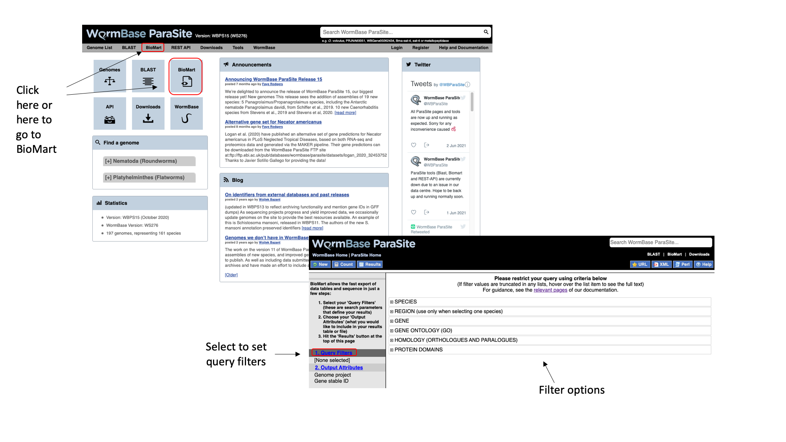
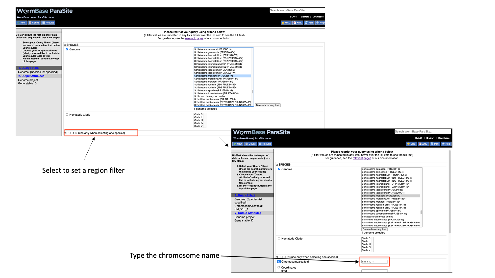
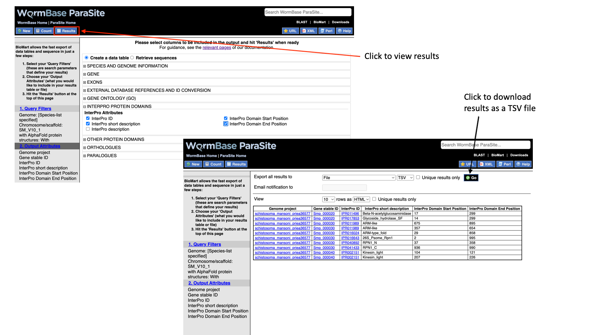
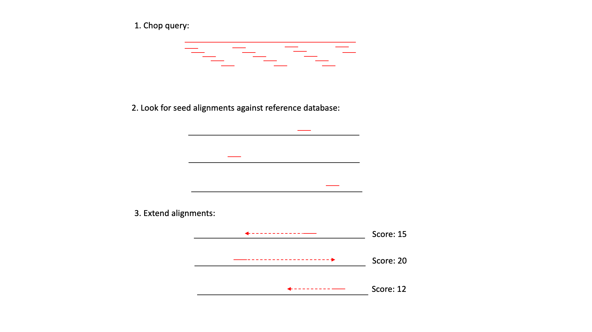
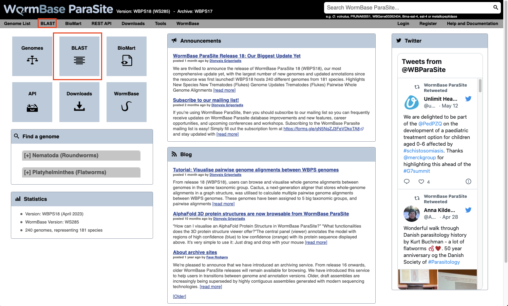
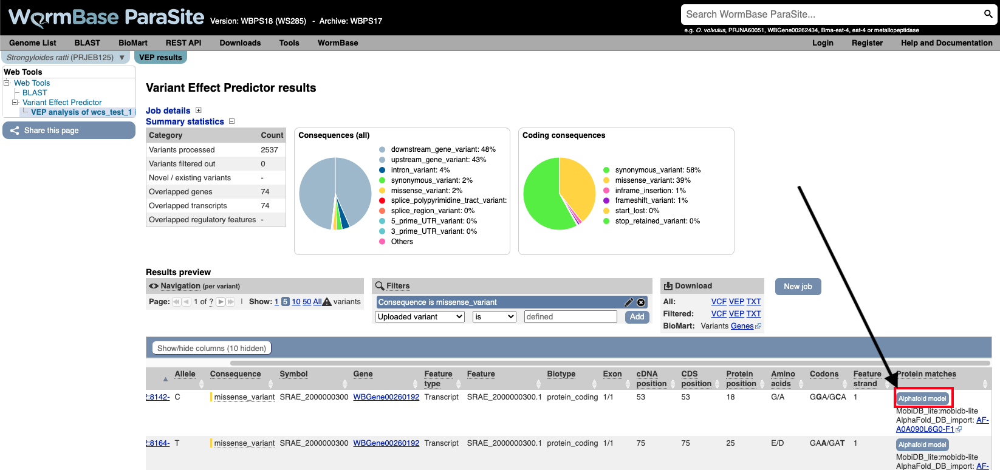

# WormBase ParaSite (part 2) Tools

## Table of contents
1. [Overview and Aims](#aims)
2. [BioMart-Data Retrival](#biomart)
      *  [_EXERCISE 1_BioMart Data retrival_](#biomart_exercise)
4. [BLAST-Homoogy Search](#blast)
      * [_EXERCISE 2 BLAST search_](#blast_exercise)
4. [VEP-Variant Analysis](#vep)
      * [_EXERCISE 3 Variant Effect Prediction_](#vep_exercise)
6. [The WormBase ParaSite Expression browser](#expression_data)
7. [gProfiler -Gene-set enrichment analysis](#gene-set)
      * [_EXERCISE 4 Gene-set enrichment analysis_](#gene-set_exercise)

        

## Overview and Aims <a name="aims"></a>

In this module, we return to WormBase ParaSite.
We first would work on how to obtain different datasets from WBPS using BIOMART
We will start by looking at commonly-used tools in WBPS:
- BLAST (a sequence comparison tool) 
- VEP (a Variant Effect Predictor)
- Gene expression platform
- g:Profiler

Finally, we will go on to apply some of the command line skills that you were introduced to in module 2 to explore WormBase ParaSite data programmatically.

---
## Tools <a name="tools"></a>

## BioMart <a name="biomart"></a>

So far we have seen how you can manually browse WormBase ParaSite by searching for genes and then navigating to their gene/transcript/protein pages. However, in many cases you might have to automatically extract information from WormBase ParaSite for multiple entries. Or simply you might need to extract information about your favourite genome's features that fullfil some criteria.

BioMart is an extremely powerful tool that allows you to query WormBase ParaSite data in bulk, with no programming knowledge. Consider the information that we gathered on our _O. viverrini_ gene of interest in the previous module, by clicking around the gene page. Now imagine that rather than having one gene of interest, we actually have a list of 100 genes. That would be a lot of clicking around on gene pages! BioMart allows you to output all of this data for multiple genes in a few clicks.

Retrieving data for a list of known genes isn’t the only thing that BioMart can do. In this section, we’ll go through a series of examples and exercises that aim to illustrate the power of this tool. 

There are two main steps involved in building a BioMart query.
- **Filters**: Firstly, a set of criteria are defined which the genes, transcripts, or proteins must conform to in order to be included in the results. These are referred to as *Query Filters*. 
- **Output Attributes**: Secondly, the data-types to include in the output list are defined. These are *Output Attributes*.

Some of the *filters* allow you to enter data to filter on, e.g. a list of gene names.

- Example: if you wanted to obtain the genomic locations of a list of genes that were of interest to you, you would provide the list of gene names in the *Query Filters*, and denote that you want to see genomic locations in the *Output Attributes*.

The table below lists some examples of filters and attributes for BioMart queries:

| Examples  of Filters       | Examples of Attributes           | 
| ------------- |-------------| 
| A genome      | Gene, transcript or protein IDs | 
| A genomic region | Sequences      |
| A list of gene IDs| Identifiers from external databases (eg, Uniprot IDs)      |
| All genes that have GO term x, or protein domain Y| Protein domains or GO terms associated with a gene ID    |
| All genes that have GO term x, or protein domain Y| IDs of orthologous genes, % identity   | 


Query Filters and Output attributes can be combined to produce more complex queries and customised output.

Let's try to do this: Let's say we want to retrieve the IDs and predicted protein domains of all of the genes from _Schistosoma mansoni_ chromosome 1 that have a predicted AlphaFold 3D protein structure. We’ll walk through this example to get started.

1. From the WormBase ParaSite homepage, select BioMart from the tool bar, or the BioMart icon.



We have to set three Query Filters: the genome (the _S. mansoni_ genome), genomic location (chromosome 1), and a protein domain (genes whose protein have a predicted 3D AlphaFold model).

2. Select “Species”, tick the “genome” checkbox and scroll down to select “Schistosoma mansoni (PRJEA36577)”.


3. Select “Region”, tick the “Chromosome/scaffold” check box and type “Sm_V10_1” into the text field (you must know the exact name of the chromosome).



4. Select “Protein domains”, tick the “Limit to genes...” checkbox and select “with AlphaFold protein structures”


Note that as we have built up the query, the filters have appeared on the left hand side of the page.

5. Click “count” to count the number of genes in the database that fulfil these filter criteria.
   How many entries fullfill these requirements? 

Next we will select the output attributes. “Genome project” and “Gene stable ID” are already pre-selected as attributes:

6. Select “Output attributes”


BioMart lets us generate two types of output: **data tables**, and **sequence files** (FASTA).   
     
In this example we’ll be generating a data table. We want to retrieve the gene IDs and associated protein domains of the genes that fulfil our filter criteria.

7. Select “Interpro protein domains” and check the tick boxes for “InterPro ID”, “InterPro short description”, “Start position” and “End position”.


* Click “Results” to see a preview of your results table. The full results table can be downloaded by selecting the file type you’d like to download and clicking “Go”.



[↥ **Back to top**](#top)

---
### _EXERCISE 1 - BioMart data retrival_ <a name="biomart_exercise"></a>

PART A . Use the following _S. ratti_  gene **names** (note: names, not stable IDs) and use BioMart to answer questions 1-5.

```
SRAE_1000001600
SRAE_1000001700
SRAE_1000001800
SRAE_1000001900
SRAE_1000002000
SRAE_1000002100
SRAE_1000002200
SRAE_1000002300
SRAE_1000002400
SRAE_1000002500
```

Use the list of genes above and generate an output with:
1. their WormBase gene IDs and UniProtKB/TrEMBL IDs. 
2. the InterPro domains that they have been annotated with (InterPro short description). [Q: why do some of the output rows appear multiple times?]
3. the gene stable IDs of their _Strongyloides stercoralis_ orthologues. [Q: which gene has more than one _S. stercoralis_ orthologue?]. 
4. the names of any GO terms associated with the genes.
5. FASTA file of their peptide sequences.

---
PART B.     Use the following _S. mansoni_ gene stable IDs to answer questions 6-9:

```
Smp_000090 
Smp_000120 
Smp_000180 
Smp_000210 
Smp_000220 
Smp_000250 
Smp_000330 
Smp_000380 
Smp_000400 
Smp_000520 
Smp_000030 
Smp_000040
Smp_000050 
Smp_000070 
Smp_000080 
Smp_000130 
Smp_000140 
Smp_000150 
Smp_000160 
Smp_000170 
Smp_000320 
Smp_001085 
Smp_002080 
Smp_002180 
Smp_002550 
Smp_000020 
Smp_000075 
Smp_000100 
Smp_000110 
Smp_000370
```

6. How many of these genes have orthologues in _S. haematobium_?
7. Generate a table listing the genes in question 6. The table should also has the gene stable ID for the homologue in both species, the homology type (1-1, 1-many, etc), and the % identity between the two orthologues.
8. Of these genes, how many also do not have a human orthologue?
9. Retrieve (a) a FASTA file with the CDS sequence of each transcript encoded by these genes. Make sure that the transcript stable ID is in the header; and (b) a FASTA file containing the CDS sequence plus 100 nt downstream of the stop codon of each of those transcripts. In the header, include the transcript stable ID and the name of the scaffold that the transcript is on.

---
#### Extra BioMart queetions (only if you have time!)

10. Generate a table containing all of the protein coding genes on _Brugia malayi_ scaffold Bm_007. The table should have their gene stable IDs and start and end coordinates.
11. From this list, export a list of the gene IDs of the genes that have orthologues in _Brugia pahangi_.
12. Perform a new query and map the Gene IDs of the _Brugia pahangi_ genes identified in question 9 to their UniProt IDs.

___
13. How many worm pseudogenes are annotated in WBPS? Which worm genomes have annotated pseudogenes?

[↥ **Back to top**](#top)

----
## BLAST <a name="blast"></a>

BLAST (Basic Local Alignment Search Tool) is one of the most commonly used tools to search for sequences that are similar to each other. It is a fast searching programme that is able to compare a query sequence with hundreds to millions of sequences quickly. 

You can use BLAST to search a query sequence against the sequences in WormBase ParaSite.

### How BLAST works? 

BLAST uses three steps:

1) It 'chops' the query sequence into small 'words' of typically 3-4 amino acids for proteins or 10-12 nucleotides for DNA sequences.
2) It uses these short words to look for perfect matches across all the entries in the database.
3) When a match is found it then tries to extend the alignment by comparing consecutive letters of the word. For each new pair of letters, it evaluates whether it is a good match.
   - If it is a good match then the score is increased and if it is a bad match the score is reduced.
   - The score table for each pair of amino acids or nucleotides is precomputed and incorporated into the BLAST algorithm. 
   - The extension step will continue until the overall score drops below a given value. At this point, the extension step is dropped and the alignment is recorded with its score.
   - The results are then presented as a list of alignments with associated scores. The alignments with the highest scores are most likely to be true matches or homologues of the query sequence.


### When do we need to use BLAST?
- **Discovering new genes or proteins**: Imagine that you have sequenced a gene that is associated with drug resistance in a helminth. You know part of the DNA sequence, but you do not know which gene it belongs to. You can use WormBase ParaSite's BLAST to see if any genes correspond to your sequence!
- **Discovering variants of genes or proteins**: Imagine you have identified a new protein of helminth which is similar but not identical to any of the  known proteins for this species. You might have found a new isoform of the encoding gene.
- **Identifying orthologs and paralogs**: You can run BLAST using a protein/gene of a species to find its paralogues or its orthologues in other species.

### BLAST in WormBase ParaSite

The BLAST tool is accessible:
- From the WormBase ParaSite homepage, select BLAST from the tool bar, or the BLAST icon. 

- You can also BLAST any existing sequence in WormBase ParaSite from the sequence page of a WBPS gene/transcript/protein using the "BLAST this sequence" button. 


Both options will take you to WormBase ParaSite's BLAST tool page:


### How to evaluate Blast results?

Blast jobs are summarized in a table with a link to the results. The results page initially displays as a table with several (expandable) information columns. 
We need to pay particular attention to some metrics of the comparisons.


Metrics used in the results table:
- **Score**: The bit score gives an indication of how good the alignment is; the higher the score, the better the alignment.
- **E-value**: The E-value gives an indication of the statistical significance of each alignment. A sequence alignment that has an E-value of 0.05 means that this
similarity has a 5 in 100 (1 in 20) chance of occurring by chance alone.
- **%ID or percent identity**: Percent identity is telling you how many residues in your query are an identical match to the hit. Closely related sequences will have a much higher % identity.

Besides these parameters, you can visualize where the different hits fall within the genome by clicking at the genomic location. Zoom in or out to find out if there are other hits close to the one you selected region. Are they on the same gene? 


[↥ **Back to top**](#top)

---
### _EXERCISE 2 BLAST search exercise_ <a name="blast_exercise"></a>

- We are goint to use WormBase ParaSite BLAST to find what is encoded by the following sequence.


```
GACTTATATTCGGTTACGGAGTCCGATCCTAATCTGGAGAACTCTCGTCTGATCGACCAA
TTCATGTACGATCCGAAAAATGCCTTGGTTTGCGCGCTATTATGTATTGTTCAGTGGCCT
TCTTCCACTCTAGACTTCGAGGCTTCTCGTTGTTTGTTGTCCGAATCGTTTGGAACTAAA
ATCCCGATATTTTCCAAGTCATTTCCAGCTACATCACCCAAACTTATTCCTCATCATGAT
ATCATTCCATTCCGTCGAACTCCGTTGGATGAGATAGACTCGTCTTCTTGGCGTGGTCGT
CTTCTACGTTCGATCACAATGGCTTCTTGTGATCTGGGTCTGCTTGCCTGTGCTGGACCA
GATTCACGGTCACCTACATCTGTGCAGTGCTTTCGCCTTAGCCGGCATTTTCAAGCCGCT
CGGGCTCATGGGTCCAGGACTTTCAAGCGACCTACCGCTGTGATCAATAAATCCAGCACC
TGCAGCGTACATCCTTTGTCCGCTTGGCTTTGGTTCAATTTGACCCTTATCCCAGTCGTG
TTATACCAGCTCAATCGTGCATTATGCTCTGTGGAACTGGGTCAATTTTTACGTAAACTC
GTCCCCTGTTCAATTCATGTACGCTATCCGATTCCAATTCCAGACCGATTAGATGCACCG
AAATGTATGCTGTCTAGTTTGCGAGTCCCTGTTGAACTAGATCGCCTAGCGGCGAGTTCA
AATCTCTGGCCAACACTTGAAAAACCCGAACCGGACATCATTCGACCAACCAACCAAGCA
GAAGTGAGTAATCTGATGGTGGCCACAACCACCTTAGGTACGGATGATGTGGTGAATTTG
GAGCGTTTGGAGTTTTGGGGTGATTCGTTTATCAAACTCATGGGTACCTTGATTGTGTAC
AACCAATTACCTCAAACAGCTTCCGAGGGGGATCTGACCAGCAAACGTGTCGCGTACCTC
ACGAATACCTATCTAGCAGATATCGTCGAAAAGCTTCACTGGTCTGGCTACTGCACTGCT
CGACCGTACTTAGCTGAGACGCAGTTTTTACCGCCAACATTTGTCTTGTCCAAGCAGGCA
GATGAATCGAAACATCAGGACAGGTTGTTTGTTACGTTCCGCCGAAAGTCCCTGTCCGAT
ATGCTGGAAGCGTTGGTAGGCTACTTGCTTACTTATTCAAATCTGGAATCGGCATTTTTG
TTGCTCACTTATGGAAGTTCTAATTCGATAATCACAACAATAAGACAAAATTGGCCAAAA
CTTTTTGTGACTTCTGTTGGCTATTGGATCAAGCCAACACTTGTGTCAGACCTAACCACT
CAATCATCTGTTGAAGGCGTACTGAACTATCATTTTCGTCAACCGGTGCATCTAGTGACC
GCATTGAGACATCAAAGTGCGACGCGTGCATCTGAGAATTCACCTGATTACCAACGCCTA
GAATTCTTGGGTGACGCAGTGCTGGATTACGTAATCACCTCTCATATTTACAATGCCAAC
AGCGATTTCGACCCGGGTGTCCTCA

```
- To which species it belongs to? 
- Does it have any close hits in other genomes?
- Is this a genomic or cDNA sequence?
  
- BONUS question: Get the corresponding protein sequence and BLAST it against the genomes. How diferent are the results? Why?


[↥ **Back to top**](#top)

---
## VEP Variant Effect Predictor <a name="vep"></a>

Another WormBase ParaSite tool that we will look at today is the Variant Effect Predictor, or VEP.

A common approach to understanding the genetic basis of phenotypic differences is to identify genetic variants that are overrepresented in some populations of individuals.

For example, you might sequence two populations of worm: one that is susceptible to a drug and one that is resistant to the drug. You could then identify genomic positions where each of these populations differs from the reference genome.

VEP is a tool that allows you to predict what the consequences of these variants are: whether they fall within or near genes, and whether they result in a change to the amino acid sequence of a protein.

The standard file format for storing variation data is the [Variant Call Format (VCF)](https://samtools.github.io/hts-specs/VCFv4.2.pdf); this is another tab-delimited text format. Later in the course, you’ll see how to make one of these files. In the meantime, for some helminth genomes, these files have already been shared by other researchers. Today you’ll be using an available VCF file for _Strongyloides ratti_ corresponding to the first 250kb of _S. ratti_ chromosome 2.  The file is in this same folder.


1. Copy the file to the "Module_3_WormBaseParaSite_2" directory and have a look at it to see how a VCF file is structured:

```bash
# look at the contents
less sratti*.vcf
```

You'll have to scroll down beyond the headers (lines starting with ##) to see the data lines. The actual data lines looks like:


2. From the WormBase ParaSite homepage, select “Tools” from the toolbar.
3. From the “Tools” page, select Variant Effect Predictor
4. To submit a VEP job, just select the correct species (_Strongyloides ratti_), upload the VCF file we just downloaded and click “Run”.


5. Once you have clicked "Run", your input will be checked and submitted to the VEP as a job. All jobs associated with your session or account are shown in the "Recent Tickets" table. You may submit multiple jobs simultaneously.

6. Navigate to the results page:


The results are presented in pie-charts and an interactive table:
- Pie Charts: The pie charts give a summary of the consequences of the variants found in the file. Variants with coding consequences are found in the protein-coding sequence of genes, whilst variants with non-coding consequences are in intergenic regions or non-coding regions of genes. These variants could still be functionally important; for example, variants in non-coding regions near genes can have effects on expression dynamics.
- Results Table: The results table shows one row per transcript and variant. By default all of the columns are shown; to temporarily hide columns, click the blue "Show/hide columns" button and select or deselect the columns you wish to view. The columns you select will be recalled when viewing other jobs.

7. You can explore the results interactively on the webpage using the Results Preview filter panel at the centre. Use this panel and filter for variant that cause (select "consequence") changes to amino acids (select "missense_variant").  

You can actually visualise the affected Amino acid by the "missense_variant" on the protein's 3D AlphaFold model ([We talked about these in our previous WBP module](https://github.com/WCSCourses/HelminthBioinformatics_2023/blob/main/manuals/module_1_WBP1/module_1_WBP1.md#af)).

To do this:

8. Go to the "Protein matches" column of the results table. If the "Protein matches" column has not been switched on you can do so by using the "Show/hide columns" button at the top left of the table". If the protein affected by the "missense_variant" has an AlphaFold protein model available, then you should see an "AlphaFold model" button in the "Protein matches" column. Click it.



9. Explore the 3D protein model. You can  Click the "Focus" button underneath the variant information to zoom-in to the affected residue.


[↥ **Back to top**](#top)

### _EXERCISE 3 : Variant Effect Prediction exercise_ <a name="vep_exercise"></a>

Download the VEP results from the example above as a “VEP file”. Use this file and the original VCF file to answer the following questions. 
You can either filter the table using a spreadsheet manager like the LibreOfficecalc or else you can try to use some of the command line skills you already learned. 

1. How many variants were there in the original dataset?

2. What are the different types of consequence that are found in the file, and how often does each occur?

3. List all of the variants found in SRAE_2000005500.1.  Which variant or variants show the greatest impact?

4. Create a list of genes where a missense variant is found.  

5. Find out which genes has the highest number of missense mutations.  View the distribution of variants along the coding sequence in Jbrowse.

Hint: to view the VCF in JBrowse you first need to compress and index it. Do:

```bash
bgzip file.vcf && tabix -p vcf file.vcf.gz
```

[↥ **Back to top**](#top)

## The WormBase ParaSite Expression browser <a name="expression_data"></a>

Earlier in this section, we looked at a gene in JBrowse and used RNAseq tracks to see in which life stages it was expressed. What if you were interested in transcriptional differences between life stages, but didn't have a specific gene in mind?

You might want to retrieve **all** of the _S. mansoni_ genes that are differentially expressed between 2 life cycle stages. 

WormBase ParaSite has collated RNAseq data from publicly available studies and analysed it against our genomes and annotations.

This means that if somebody has already conducted a study to compare the conditions that you're interested in, you can look up pre-calculated differentially expressed genes. 

1. Navigate back to the _S. mansoni_ genome landing page, and select "Gene expression"


2. We can see a summary of the different studies that have been conducted. We're interested in life cycle stages, so select the first study "Schistosoma mansoni transcriptomics at different life stages". 


For each study, we have a summary of the conditions for which data is available. You'll learn much more about how transcriptomic experiments are analysed in module 7, but for those who are interested we have used HISAT2 to align reads to the genome, HTSeq to quantify counts per gene and DESeq2 to compute differential expression per condition.

Several files are available for download. These are:

* **Characteristics and conditions per run** - a file summarising the metadata available for each sample/run in the study.
* **Counts of aligned reads per run (FeatureCounts)** - for each gene, raw counts per sample/run as produced by HTSeq (not normalised for library size).
* **Gene expression (TPM) per run** - for each gene, counts per sample/run normalised for gene length and library size (TPM = transcripts per million).
* **Gene expression (TPM) per condition as median across replicates** - As above, but a median value is calculated for each gene from all samples/runs of the same condition.
* **Differential expression** - The number of files here varies. For each experiment, we extract the different conditions for which pair-wise comparisons are possible. For this experiment, only one variable is changing between the samples (developmental stage), so we have 3 possible contrasts: 24h schistosomule v 3h schistosomule, 24h schistosomule v cercariae and 3h schistosomule v cercariae. The second study in the list ("Praziquantel mode of action and resistance") is more complicated; we have several facets changing between conditions (drug treatment, development stage, timepoint, strain **and** sex), resulting in many more possible contrasts. We calculate differential expression for any pairwise combination of conditions that have three or more replicates: it's down to you to choose which of those comparisons is biologically meaningful. There are 2 types of file available here:
    - Summary files: for each combination of variables for which comparisons have been calculated, this file contains the genes that show a significant difference in at least one comparison. 
    - Full results files: each of these files contain the full DESeq2 results for a contrast (i.e., fold changes for ALL genes, whether or not they are statistically significant).

3. Download the full results files for the "Schistosoma mansoni transcriptomics at different life stages" "24-hour-schistosomule-vs-cercariae" experiment by clicking "Full result files for 3 contrasts (zipped) and place it into the "Module_3_WormBaseParaSite_2" directory.

```bash
cd ~/Module_3_WormBaseParaSite_2

# Extract the compressed directory
unzip ERP000427.de.contrasts.zip

# move inside the results directory
cd ERP000427.de.contrasts

# have a look at the 24-hour-schistosomule-vs-cercariae file

head -n 20 24-hour-schistosomule-vs-cercariae.tsv  
or  
grep -v "^#" 24-hour-schistosomule-vs-cercariae.tsv | less
```

Use some of the commands you learned yesterday to extract the following information from the "24-hour-schistosomule-vs-cercariae.tsv" file:

4. Extract the top 5 most significantly regulated genes
    (hint: the final column, "padj", gives the adjusted p value. A smaller adjusted p value = more significant).


```bash
grep  "^Smp_" 24-hour-schistosomule-vs-cercariae.tsv | LC_ALL=C sort -g -k 7,7 | awk -F'\t' '$7 != "NA"' | head -n 5
```


5. Of the genes with an adjusted p-value that is less than 0.05, which is   
    (a) most highly upregulated in the 24h schistosomules v the cercariae   

    (b) most strongly upregulated in the cercariae v the 24h schistosomules?       

```bash
# upregulated in the 24h schistosomules means that Log2FoldChange (column 3) should be a positive number

grep  "^Sman_" 24-hour-schistosomule-vs-cercariae.tsv | awk -F'\t' '$7 < 0.05 && $3 > 0' | LC_ALL=C sort -r -g -k 3,3 | head -n 10
```

```bash
# upregulated in the cercariate means that Log2FoldChange (column 3) should be a negative number

grep  "^Sman_" 24-hour-schistosomule-vs-cercariae.tsv | awk -F'\t' ' $7 < 0.05 && $3 < 0' | LC_ALL=C sort -g -k 3,3 | head -n 10
```


[↥ **Back to top**](#top)

---
## gProfiler - Performing Gene-set enrichment analysis <a name="gene-set"></a> 

Gene set enrichment analysis (GSEA) (also called functional enrichment analysis or pathway enrichment analysis) is a method to identify classes of genes or proteins that are over-represented in a large set of genes or proteins, and may have an association with disease phenotypes.


In the previous module we talked about Gene Ontology (GO) [here](https://github.com/WCSCourses/HelminthBioinformatics_2023/blob/wbps_edits/manuals/module_1_WBP1/module_1_WBP1.md#go_terms).

"Gene Ontology" enrichment analysis is one of the most commonly used enrichment analyses.

Gene ontology is a formal representation of knowledge about a gene with respect to three aspects:
Molecular Function, Cellular Component and Biological Process.

So what is the Gene Ontology (GO) enrichment analysis?

Fundamentally, the gene ontology analysis is meant to answer a very simple question: “What biological processes, molecular functions, and cellular components are significantly associated with a set of genes or proteins?”

For example, we can take the list of genes we identified as significantly upregulated in cercariae vs 24h-schistosomules and try to identify what are the biological processes, cellular components and molecular functions that are implicated in this developmental stage comparison.

Instead of manually trying to identify which genes in your list of differentially expressed genes have similar biological processes, cellular component and molecular functions, the GO enrichment analysis does it for you. More specifically, it clusters the genes into gene ontologies group, performs statistical analysis and shows you the most significantly overepressented ontologies!

So basically a GO enrichment analysis takes a list of gene identifiers like this:


and organises them to Gene Ontology terms (GO):


<br><br>

WormBase ParaSite offers a tool that performs this kind of analysis: g:Profiler that can be accessed from the "Tools" page:

- Go to WormBase ParaSite (https://parasite.wormbase.org/).
  
- Click "Tools" at the top menu.

- Click "g:Profiler" in the tools table.

  


[↥ **Back to top**](#top)

---

### _EXERCISE 4 : Gene -set enrichment analysis exercise_ <a name="gene-set_exercise"></a>


Use the 24-hour-schistosomule-vs-cercariae.tsv from the previous section and print a list of genes with an adjusted p-value that is less than 0.05, which are most strongly upregulated in the cercariae v the 24h schistosomules.  

1. Use gProfiler and perform a Gene-set enrichment analysis for these 40 genes from the "Schistosoma mansoni (PRJEA36577)" organism.  

2. Which are the 3 most significantly enriched Cellular Component terms? Are they relevant to this developmental stage comparion we're performing?

3. Expand the stats by using the ">>" in the header of the GO:CC result table. Try to interpret the T, Q, TnQ and U metrics. What do they represent?  


    <details closed>
    <summary>**Useful tips**</summary>
    You can read more here: https://biit.cs.ut.ee/gprofiler/page/docs<br>
   * **T - Term Size**: How many S. mansoni genes are in general associated with this term.<br>
   * **Q - Query Size**: The number of genes in our gene list (the one we run the analysis for). In our case this number should theoretically be 40, however it is 14, why?<br>
   * **TnQ - Overlap Size**: How many genes from our list are associated with this term.<br>
   * **U - Total number of _S.mansoni_ genes.<br>
    </details>

[↥ **Back to top**](#top)

---


