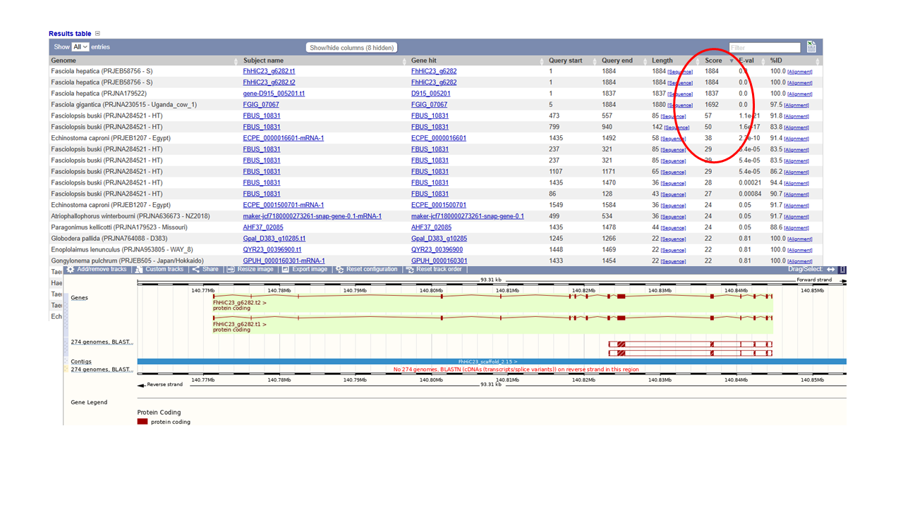
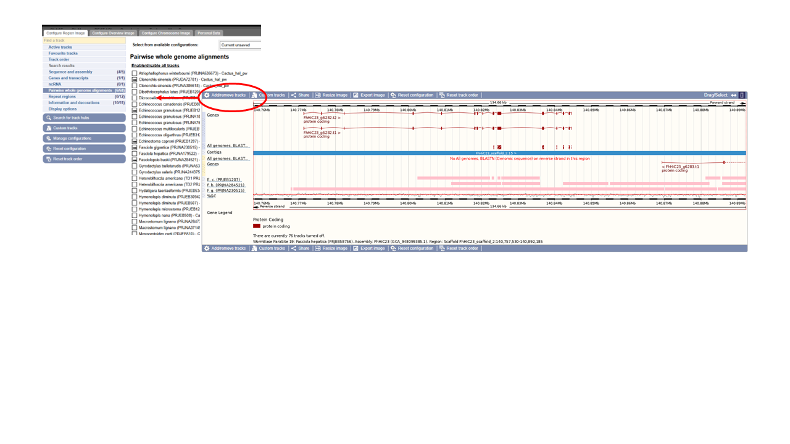
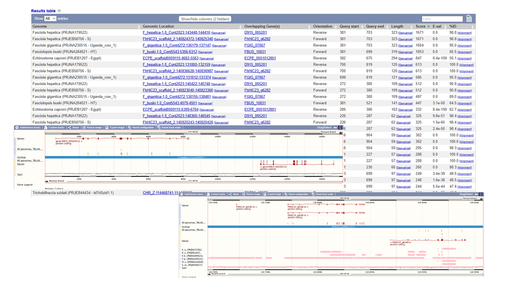

## Table of contents
1 [BioMart exercise](#biomart_exercise)    
2 [BLAST exercise](#blast_exercise)   
3 [VEP exercise](#vep_exercise)    
4 [Enrichment exercise](#enrichment_exercise)   

---


## BioMart exercise <a name="biomart_exercise"></a>

Use the following _S. ratti_  gene **names** (note: names, not stable IDs) and use BioMart to answer questions 1-5:

Use the list of genes above and generate an output with:
1. their WormBase gene IDs and UniProtKB/TrEMBL IDs. 
2. the InterPro domains that they have been annotated with (InterPro short description). [Q: why do some of the output rows appear multiple times?]
3. the gene stable IDs of their _Strongyloides stercoralis_ orthologues. [Q: which gene has more than one _S. stercoralis_ orthologue?]. 
4. the names of any GO terms associated with the genes.
5. FASTA file of their peptide sequences.

Solution:
For all the above questions, participants should set the same "Query Filters":
- From the WormBase ParaSite homepage, select BioMart from the tool bar, or the BioMart icon. 
- Set the "Query Filters":
   * Select “SPECIES”, tick the “genome” checkbox and scroll down to select “Strongyloides ratti (PRJEB125) [WS285]”. 
   * Select "GENE", tick the "ID list limit" check box, select "Gene Name(s)" on the dialogue box above the text box and copy-paste the given gene list into the text box underneath.

For each question the "Output Attributes" change
- Set the "Output Attributes" by clicking "Output Attributes" on the left menu.
- For question 1:
  - Select "SPECIES AND GENOME INFORMATION": Untick the by-default selected "Genome project". 
  - Select "GENE": Untick the by-default selected "Gene stable ID". 
  - Select "EXTERNAL DATABASE REFERENCES AND ID CONVERSION": Tick "WormBase gene ID" and "UniProtKB/TrEMBL ID" boxes.
  - Click "Results" at top left.
- For question 2:
  - Click "Output Attributes" on the left menu to change the previously set output attributes. Untick all the ones you ticked for the previous question.
  - Select "GENE": Tick the by "Gene stable ID" box.
  - Select "INTERPRO PROTEIN DOMAINS": Tick the "InterPro short description" tick box.
  - Click "Results" at top left.
  - Why do some of the output rows appear multiple times? Some genes will have multiple annotated InterPro domains. These will appear as duplicate rows.
- For question 3:
  - Tick "Output Attributes" on the left menu to change the previously set output attributes. Untick all the ones you ticked for the previous question.
  - Select "GENE": Tick the by "Gene stable ID" box.
  - Select "ORTHOLOGUES": Scroll until you find the "Strongyloides stercoralis (PRJEB528) Orthologues" tab. Then tick the "Strongyloides stercoralis (PRJEB528) gene stable ID" tick box.
  - Click "Results" at top left.
  - which gene has more than one _S. stercoralis_ orthologue? The one with duplicated rows (WBGene00256613 -> SSTP_0001203000 and SSTP_0001203100).
- For question 4:
  - Tick "Output Attributes" on the left menu to change the previously set output attributes. Untick all the ones you ticked for the previous question.
  - Select "GENE ONTOLOGY (GO)": Tick the "GO term name" tick box.
  - Click "Results" at top left.
- For question 5:
  - Tick "Output Attributes" on the left menu to change the previously set output attributes. Untick all the ones you ticked for the previous question.
  - Select the "Retrive sequences" round button at the top of the page.
  - Select "SEQUENCES": Tick the "Peptide" round button.
  - Click "Results" at top left.

---
Use the following _S. mansoni_ gene stable IDs to answer questions 6-9:

* Set the "Query Filters":
   * Select “SPECIES”, tick the “genome” checkbox and scroll down to select “Schistosoma mansoni (PRJEA36577) [WS285]”. 
   * Select "GENE", tick the "ID list limit" check box, select "Gene Name(s)" on the dialogue box above the text box and copy-paste the given gene list into the text box underneath.

6. How many of these genes have orthologues in _S. haematobium_?
* Expand the "Query Filters" selection:
   *  HOMOLOGY -> Restict results to genes with orthologues in... (tick box) -> Schistosoma haematobium (PRJNA78265)
* Click Count at the top left of the page: 16 genes.

7. Generate a table listing the genes in question 6. The table should also has the gene stable ID for the homologue in both species, the homology type (1-1, 1-many, etc), and the % identity between the two orthologues.
* Keep the same "Query Filters"
* Set the "Output Attributes"
   * Untick Genome Project from the SPECIES AND ... tab
   * Tick "Gene stable ID" from the GENE tab
   * Go to the "ORTHOLOGUES" tab and scroll until you find "Schistosoma haematobium (PRJNA78265) Orthologues". Tick "gene stable ID", "Homology type", "%identity"
   * Click Results

8. Of these genes, how many also do not have a human orthologue?
* Just add to the "Query Filters": HOMOLOGY -> Restrict results to genes without orthologues in... (tick box) -> Human
* Click Count at the top left of the page: 11 gene.

9. Retrieve (a) a FASTA file with the CDS sequence of each transcript encoded by the genes from question 6. Make sure that the transcript stable ID is in the header; and (b) a FASTA file containing the CDS sequence plus 100 nt downstream of the stop codon of each of those transcripts. In the header, include the transcript stable ID and the name of the scaffold that the transcript is on.
Use the "Query Filters" from Question 6

* (a)
   * "Output Attributes" -> "Retrieve sequences" at the top of the menu:
   * "SEQUENCES" -> Coding Sequence
   * "HEADER INFORMATION" -> Trascript Attributes -> Transcript stable ID -> Result
* (b)
   * "Output Attributes" -> "Retrieve sequences" at the top of the menu:
   * "SEQUENCES" -> Coding Sequence & "SEQUENCES" -> Downstream flank (tick box): 100
   * "HEADER INFORMATION" -> Trascript Attributes -> Transcript stable ID & Chromosome/scaffold name -> Result


----
## BLAST exercise <a name="blast_exercise"></a>

Use WormBase ParaSite BLAST to find out the identity of this sequence, and which species it belongs to. Does it have any close hits in other genomes? Try BLASTing against both cDNA and a genomic DNA databases. What kind of sequence is this?

- Use the provided sequence as input in WBPS Blast tool and run two different jobs  
     one against genomic DNA (Search Against: All species, DNA database: Genomic Sequence) and  
     one agaist cDNA (Search Against: All species, DNA database: cDNAs).

- Examine the results:

  Against Genomic Sequences:
    - First look at the results table. Usally output is ordered by score. Scrolling down you might see that several hits overlap to the same gene. Toggle the query start and end in the table. You might see that they could represent different exons.  
    - Go the genomic location of the hit with the best score. You can zoom out to see all hits on the region (overlapping gene).


            
  Against cDNA:
   - now you have a first top result with a very high score and covering the whole query.
   - Go to ovelaping gene or genomic location. Instead of independent blocks of homology, you see them unified in a box. 



 _The gene selected corresponds to a fragment of the cDNA of Fasciola hepatica Dicer2.  
  There are two assemblies of F.hepatica so they might pick any of them and compare._
    
- Does it have close hits on other genomes ?   
   - You can get that from looking at the hits table.  
   - Also on the "genomic location" view you can go to tracks and toggle "pairwise genomic alignments" this would highlight the regions of homology.  



- Bonus Question:  Get the corresponding protein sequence and BLAST it against the genomes. How diferent are the results? Why?  

  - Go to the top hit gene and get the fasta protein sequence. Run a TBlastN comparison.  
   - Inspect the results table, from the top hit genomic location view zoom out till covering the neighbour genes. You will see hits on gene g6383 also.

     

----
## VEP exercise <a name="vep_exercise"></a>

Download the VEP results from the example above as a “VEP file”. Use this file and the original VCF file to answer the following questions:

- Click the "VEP" button located within the facet, which is positioned at the center of the page on the VEP results page.
- Place the downloaded *.vep.txt file inside the module's directory and rename it:
```
mv ~/Downloads/*.vep.txt ~/Module_3_WormBaseParaSite_2/sratti.vep.txt
cd ~/Module_3_WormBaseParaSite_2/
```
1. How many variants were there in the original dataset?
```
# grep to remove the header. wc -l to count the variants of the original vcf file
grep -v "^#" sratti_*.vcf | wc -l| wc -l
```

2. What are the different types of consequence that are found in the file, and how often does each occur?

Lots of ways of doing it...
e.g
```
# remove first line with grep.  extract column 7 with unix cut command, then sort, collapse to unique instances and count
% grep -v '^#' sratti.vep | cut -f 7 | sort | uniq -c
```
Can also be done with awk:
```
# Print a unique list of all the values under the "Consequence" column of the file:
awk -F'\t' 'NR==1 {for (i=1; i<=NF; i++) if ($i == "Consequence") {col=i; break}} NR>1 {print $col}' sratti.vep.txt | sort | uniq

# Count each consequence's occurence and sort them in ascending order
awk -F'\t' 'NR==1 {for (i=1; i<=NF; i++) if ($i == "Consequence") {col=i; break}} NR>1 {print $col}' sratti.vep.txt | sort | uniq -c | sort
```
3. List all of the variants found in SRAE_2000005500.1.  Which variant or variants show the greatest impact?
```
# One way to list them is:
grep "\tSRAE_2000005500.1\t" sratti.vep.txt

#OR
awk '$5=="SRAE_2000005500.1"' sratti.vep | grep HIGH 

# Another more specific solution by looking for "SRAE_2000005500.1" in the Feature column:
awk -F'\t' 'NR==1 { for (i=1; i<=NF; i++) if ($i == "Feature") {col=i; break} } $col=="SRAE_2000005500.1"' sratti.vep.txt

# The impact of the variants is noted in the IMPACT field of the last column (e.g. IMPACT=MODERATE)
# First list all the possible IMPACT values:
awk -F'\t' 'NR==1 { for (i=1; i<=NF; i++) if ($i == "Feature") {col=i; break} } $col=="SRAE_2000005500.1"' sratti.vep.txt | grep -o 'IMPACT=[^;]*' | sort | uniq

# It looks like the IMPACT=HIGH is the tag for the greatest impact
# List the variants with IMPACT=HIGH for SRAE_2000005500.1
awk -F'\t' 'NR==1 { for (i=1; i<=NF; i++) if ($i == "Feature") {col=i; break} } $col=="SRAE_2000005500.1"' sratti.vep.txt | grep 'IMPACT=HIGH;'
```


4. Create a list of genes where a missense variant is found.
```
# First list all variants that are missense variants (Consequence=missense_variant)
# Simple method:
grep "\tmissense_variant\t" sratti.vep.txt
# More advanced specific method:
awk -F'\t' 'NR==1 { for (i=1; i<=NF; i++) if ($i == "Consequence") {col=i; break} } $col=="missense_variant"' sratti.vep.txt 

# Then, from the above output get a unique list of all the values of the "Gene" column
grep "\tmissense_variant\t" sratti.vep.txt | cut -f4 | sort | uniq

# Another more advanced way
awk -F'\t' 'NR==1 { for (i=1; i<=NF; i++) { if ($i == "Consequence") consequenceCol=i; if ($i == "Gene") geneCol=i } } $consequenceCol=="missense_variant" { print $geneCol }' sratti.vep.txt | sort | uniq
```  

5. Find out which genes has the highest number of missense mutations.  View the distribution of variants along the coding sequence in Jbrowse.
```
# Just add a sort | uniq -c in the previous command
awk -F'\t' 'NR==1 { for (i=1; i<=NF; i++) { if ($i == "Consequence") consequenceCol=i; if ($i == "Gene") geneCol=i } } $consequenceCol=="missense_variant" { print $geneCol }' sratti.vep.txt | sort | uniq -c | sort
```
From the previous command we get that the answer is the "WBGene00260238" gene.

To view the VCF in JBrowse:
1. compress and index it.
```
bgzip file.vcf && tabix -p vcf file.vcf.gz
```
2. From the WormBase ParaSite homepage, click either the ”Genome List” tab in the tools bar, or the “Genomes” icon.
3. Scroll down the page to find _Strongyloides ratti_ and click the "Jbrowse" link.
4. Use the Jbrowse search bar and search for "WBGene00260238".
5. From the top menu bar select Track -> Open track file or URL -> Select Files (select your files both .gz.vcf and .gz.vcf.tbi) -> Open

-----
## Gene-set enrichment analysis exercise <a name="enrichment_exercise"></a>

Use the 24-hour-schistosomule-vs-cercariae.tsv from the previous section and print a list of genes with an adjusted p-value that is less than 0.05, which are most strongly upregulated in the cercariae v the 24h schistosomules.

1. Use gProfiler and perform a Gene-set enrichment analysis for these 40 genes from the "Schistosoma mansoni (PRJEA36577)" organism.
- Extract genes
```
grep -v "^#" 24-hour-schistosomule-vs-cercariae.tsv | grep -v "^gene_id" | awk -F'\t' '$7 != "NA" && $7 < 0.05 && $3 < 0' | sort -g -k 3,3 | head -n 40 | cut -f1
```
-  Paste the list of gene IDs into the central text box. Select "Schistosoma mansoni (PRJEA36577)" under WormBase ParaSite using the "Organism" drop-down menu and then click on "Run Query"

- When results appear, scroll down and hover over the points in the graph to explore gene ontologies which are over-represented in your list of genes. You can also click on "Detailed Results" tab to see a table with all the enriched Gene ontology terms.

2. Which are the 3 most significantly enriched Cellular Component terms? Are they relevant to this developmental stage comparion we're performing?
- When results appear, click on the Detailed Results tab.
- These are the top 3 enriched CC: respirasome, mitochondrion, cytochrome complex

3. Expand the stats by using the ">>" in the header of the GO:CC result table. Try to interpret the T, Q, TnQ and U metrics. What do they represent?
You can read more here: https://biit.cs.ut.ee/gprofiler/page/docs
    * T - Term Size: How many S. mansoni genes are in general associated with this term.
    * Q - Query Size: The number of genes in our gene list (the one we run the analysis for). In our case this number should theoretically be 40, why it's 14?
    * Q - Overlap Size: How many genes from our list are associated with this term.
    * U - Total number of S. mansoni genes.
