# Single-cell transcriptomics

### Instructor: Santiago Fontenla, addapted from the tutorial by Teresa Attenborough 
## Affiliation: University of Glasgow


## Table of Contents
1. [Overview and Aims](#intro)
2. [Introduction to single cell transcriptomics](#basic)
3. [Setup the Seurat Object](#seurat)
4. [Standard preprocessing workflow](#preprocessing)
    * [Doublet cells removal](#doubletremoval)
    * [QC removal](#QCremoval)
5. [Data normalization and scaling](#normalization)
    * [Classic normalization](#classic)
    * [SCTransform](#SCTrasform)
6. [Perform dimentional reduction](#PCA)
7. [Determine the 'dimentionality' of the dataset](#dimentionality)
8. [Cluster the cells](#cluster)
9. [Run non-linear dimensional reduction (UMAP)](#umap)
10. [Finding differentially expressed features (cluster biomarkers)](#biomarkers)
    * [Explote the expression of specific genes in the UMAP](#plotGenes)
11. [Assigning cell type identity to clusters](#renameUMAP)

---

## 1. Overview and Aims <a name="intro"></a>

In this module, you will learn basic concepts about the technology and data structure related to single-cell data. The data used in the module was generated from 3 replicates of the 2 days somules of _Schistosoma mansoni_. You will start examining the raw data and the structure of the count matrices, you will learn how to get data from the Seurat objects and how to do the standar normalization and scaling. You will learn how to  generate cell clusters and plot different variables.


---

[↥  **Back to top**](#top)

## 2. Introduction to single cell transcriptomics <a name="basic"></a>

Single-cell RNA sequencing (scRNA-seq) technology has become the state-of-the-art approach for unravelling the heterogeneity and complexity of RNA transcripts within individual cells, as well as revealing the composition of different cell types and functions within highly organized tissues/organs/organims. scRNA-seq allows the analysis of individual cells, revealing subtle differences in gene expression that might be masked in bulk sequencing, potentially identifying rare cell populations. However scRNA-seq can be expensive and complex to set up and performa, limiting its widespread adoption. 

The scRNA-seq data used in the module was obtained from 2 day schistosomula of _S.mansoni_ after _in vitro_ transformation of cercariae. Single-cells were obtained after tissue dissociation with a digestion solution. Single-cell concentration was estimated by flow-cytometry and loaded according to the 10X Chromium Single Cell 3' Reagent Kits v2 protocol. Library construction was done using standar protocols and sequenced on an Illumina HiSeq4000 (PE reads 75 bp) [ref](https://www.nature.com/articles/s41467-020-20092-5). For these tutorial, scRNA-seq data were mapped to the reference genome V10 using [Cell Ranger (version 7.0.1)](https://www.10xgenomics.com/support/software/cell-ranger/latest)

---

[↥  **Back to top**](#top)

## 3. Setup the Seurat Object <a name="seurat"></a>

After sequencing, reads are mapped to the reference genome with Cell Ranger, a set of analysis pipelines that process Chromium Next GEM single cell data to align reads and generate feature-barcode matrices. To do this, transcripts from different cells are identified through a 10X barcode, while different transcripts of each cell are identified through a unique molecular identifier or UMI.

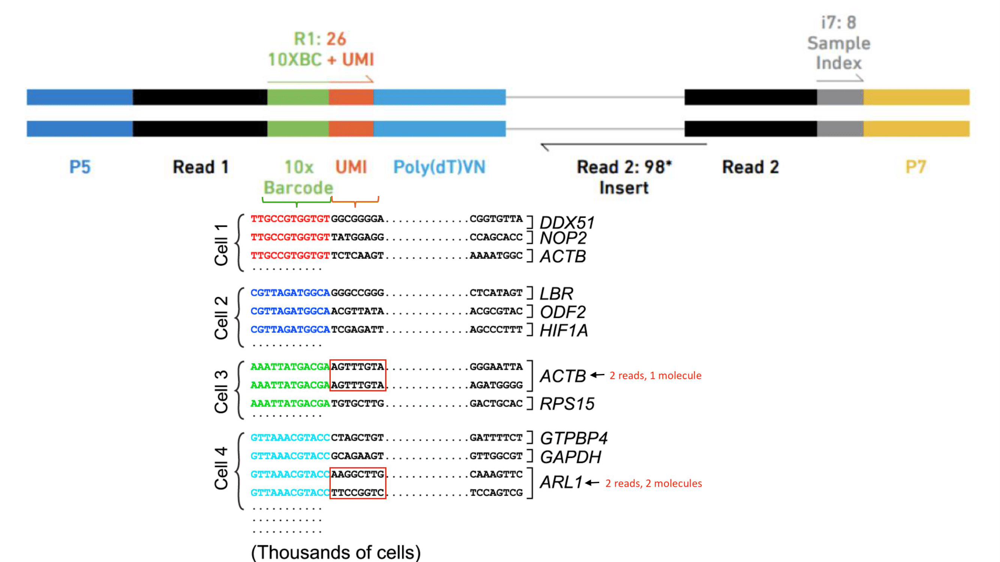
**Figure 1.** A set of barcodes are used to identify different transcripts and cells.

Navigate to the output folder of Cell Ranger, within each sample folder you will find a web_summary of the run and a feature-barcode folder containing the feature-barcode_matrix. Inspect each web_summary. 

Three key metrics are presented at the top left of the Summary tab:

- **Estimated Number of Cells**: the number of barcodes associated with cells.
- **Mean Reads per Cell**: the total number of sequenced reads divided by the number of cells. A minimum of 20,000 read pairs per cell is recommended.
- **Median Genes per Cell**: the median number of genes detected per cell-associated barcode. This metric is dependent on cell type and sequencing depth.


**Figure 2.** Main metrics of Cell Ranger run

We are not planning to go through the rest of the sections and metrics, for more details of each metrics and their expected range, please refer to the [10xGenomics_documentation](https://www.10xgenomics.com/analysis-guides/quality-assessment-using-the-cell-ranger-web-summary)

```R
# We will do the analysis in RStudio
# Set the route to the working directory that contains the folders with the Cell Ranger outputs for each sample

setwd("/set/your/path/here/")

```

We will use Seurat and other packages in this module. Seurat is an R package designed for QC, analysis, and exploration of single-cell RNA-seq data. Seurat aims to enable users to identify and interpret sources of heterogeneity from single-cell transcriptomic measurements, and to integrate diverse types of single-cell data.

The first step is to install the packages we are going to need for this script. Run the two below chunks to install the packages you'll need. You only need to install the packages once. This might take a few minutes as the libraries can be large. 

The first chunk sets up a function to check if packages are installed, install them if not and load them. The second chunk takes a list of the packages we'll need, and runs the function on them. After these two chunks, you should have loaded all the libraries you'll need.

```R
# function to check install and load packages
load_library <- function(pkg) {
  # check if package is installed
  new_package <- pkg[!(pkg %in% installed.packages()[, "Package"])]
  
  # install any new packages
  if (length(new_package)) 
    install.packages(new_package, dependencies = TRUE, Ncpus = 6)
  
  # sapply to loop through and load packages
  invisible(sapply(pkg, library, character.only = TRUE))
  
  # give message confirming load
  message("The following packages are now loaded")
  print(names(sessionInfo()$otherPkgs))
}
```

Now, load the packages that you'll use in the session.

```R
packages <- c('tidyverse', 'Seurat', 'RColorBrewer', 'patchwork', 'clustree', 'BiocParallel', 'SingleCellExperiment', 'scDblFinder')
load_library(packages)
```

Here we save an object that contains today's date, so we can save any files with the date automatically.

```R

st <- format(Sys.time(), "%Y-%m-%d") 

```
#### Data import to R

Next, we import the data files that contain the mapping outputs from Cell Ranger. There are three folders, from the three samples which were sequenced. Each folder contains the list of genes, the cell barcodes, and the count matrix showing the number of transcripts.

Since the data was generated with 10X sequencing, we import this into R using the specific 10X import function.

```R

sample1.data <- Read10X('sample1/filtered_feature_bc_matrix/')
sample2.data <- Read10X('sample2/filtered_feature_bc_matrix/')
sample3.data <- Read10X('sample3/filtered_feature_bc_matrix/')

```

Lets see how the data looks like, dim() returns the number of rows and columns of a data.frame (df). Use head() and tail() to inspect of how the data actually looks like, here we are selecting the first 35 columns and the first or last 20 rows of the df. What do you see?

```R

dim(sample1.data)
head(sample1.data[,1:35],n=20L)
tail(sample1.data[,1:35],n=20L)

```

### Creating a Seurat object

Seurat is a widely used R package for single cell analysis. This function converts the matrix above into a 'Seurat object'. This allows you to perform a variety of analyses, and store metadata and analysis results all together.

Here you will filter out any cells with less than 300 genes detected, and any genes in less than 3 cell, to pre-filter out any really low quality cells and reduce noise. I'm also adding the information to each Seurat object of which sample it comes from.

```R

sample1 <- CreateSeuratObject(counts = sample1.data, project = "sample1", min.cells = 3, min.features = 300)
sample2 <- CreateSeuratObject(counts = sample2.data, project = "sample2", min.cells = 3, min.features = 300)
sample3 <- CreateSeuratObject(counts = sample3.data, project = "sample3", min.cells = 3, min.features = 300)

```

🚩 **Note the warning.** For _S.mansoni_, gene IDs are start with Smp and are linked to a six digit number by an underscore, e.g. Smp_349530. Seurat is not set up to accept underscores in gene names, so converts them to underscores, e.g. Smp-349530. This is important when linking our analysis back to the genome.

How does these look now?

```R

sample1

```
So here can see that there are 8,105 genes (of features) detected in this sample, and there are 1,724 cells.

You can also access the number of genes and cells of each sample

```R

dim(sample1)
dim(sample2)
dim(sample3)

```

Using the command head() and rownames() you also can access the genes in this objects, in this example you can see the first 20 genes.

```R

head(rownames(sample1),n=20)

```

You can access the first 20 cells with the commands head() and colnames() 

```R

head(colnames(sample1),n=20)

```

You can also access the metadata of the object, such as which sample this object came from.

```R

head(sample1@meta.data$orig.ident)

```
If you're not sure which metadata are available, or you want a summary of metadata in each category, that's an easy way to check. Anything that comes after the R object name and a dollar sign is a metadata value so you can look at it in a table as above, or in a UMAP, once you've generated one.

[↥  **Back to top**](#top)

## 4. Standard preprocessing workflow <a name="preprocessing"></a>

### Doublet ID <a name="doubletremoval"></a>

Doublets, or multiplets, form when two or more cells are associated with one cell barcode - for example you might have a 'cell' in your data that looks like a hybrid of a muscle and a neural cell. Since these don't describe a cell type found in the sample, we want to exclude these cells as much as possible. There are many tools/strategies, the below tool assigns each cell a doublet score, and assigns cells as doublets or singlets based on these scores and the expected percentage of doublets. Run the following lines and set the function.

```R

Dblremove<-function(sample){
  sce <- as.SingleCellExperiment(sample,assay="RNA")
  #scDblFinder command uses a probabilist strategy to identify doublets. The set.seed() command will guarantee the same results everytime.
  set.seed(123)
  results<-scDblFinder(sce,returnType = 'table') %>%
    as.data.frame() %>%
    filter(type=='real')
  keep = results %>%
    dplyr::filter(class=="singlet") %>%
    rownames()
  sample=sample[, keep]

}

```

Run the doublet removal funtion in each sample

```R
sample1<-Dblremove(sample1)
sample2<-Dblremove(sample2)
sample3<-Dblremove(sample3)
```

Let's inspect the features and cell counts after doublet removal, how many cells were remove from each sample?

```R

dim(sample1)
dim(sample2)
dim(sample3)

```

### Merging samples

For today, we are going to combine all three of our samples simply, and run through an analysis of all three. Later on we'll be able to look at how similar the three samples are to each other. I usually will also run an analysis of each sample individually to make sure I understand the data, and the variability.

This creates one object that contains all three samples.

```R

day2somules <- merge(sample1, y = c(sample2, sample3), add.cell.ids = c("sample1", "sample2", "sample3"), project = "day2somules")
day2somules

```

Now there are 8,347 genes detected across this experiment, and there are 3,843 cells.

Can we still tell which cells came from which sample? Let's make sure by adding a metadata column to the combined Seurat object

```R

day2somules@meta.data$batches <- ifelse(grepl("2_", rownames(day2somules@meta.data)), "batch2", ifelse(grepl("3_", rownames(day2somules@meta.data)), "batch3", "batch1"))

```

How can you access the cell IDs in this object? How have these changed?

```R

head(colnames(day2somules))

```

Let's look at the metadata we've added

```R

table(day2somules@meta.data$batches)

```


### QC removal <a name="QCremoval"></a>


### Mito % 

We commonly use % of mitochondrial transcripts to screen for dead/damaged cells - we want to exclude these kinds of cells. Thresholds of % mitochondrial reads vary, and for most non-model organisms there isn't an established threshold - the optimal threshold will also vary between tissue types.

This code chunk will calculate the percentage of transcripts mapping to mitochondrial genes: in _S.mansoni_ these genes start with 9.

```R

day2somules[["percent.mt"]] <- PercentageFeatureSet(day2somules, pattern = "Smp-9")

```

### Plot for QC

Now let's plot the cell density pre-QC by nFeature (genes), nCount (transcipts) and percentage of mitochondrial RNA for each sample. 

```R

VlnPlot(day2somules, features = c("nFeature_RNA", "nCount_RNA", "percent.mt"), ncol = 3,pt.size = 0)

```

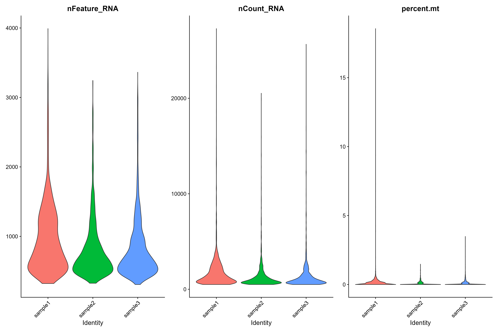
**Figure 3.** Violin plots of each sample

It's important to consider multiple measurements when screening out low quality cells - especially when working on less well known organisms. So we generally plot metadata in several ways, and use the literature to decide what thresholds to use for QC filtering.

Here, we can extract the metadata for visualisation.

```R

day2somules_metadata <- day2somules@meta.data

```

Let's compare the number of UMIs (transcripts) per cell from the three samples at the same time with a density plot. What do you see? Compare this plot to the Violin plot in Figure 3.

```R

# Visualize the number UMIs/transcripts per cell. We want to have at least 500 UMIs/cell if possible. Black lines at 500 and 1000 UMIs
day2somules_metadata %>% 
  	ggplot(aes(color=batches, x=nCount_RNA, fill=batches)) + 
  	geom_density(alpha = 0.2) + 
  	scale_x_log10() + 
  	theme_classic() +
  	ylab("Cell density") +
  	geom_vline(xintercept = 500) +
  	geom_vline(xintercept = 1000)+
  	ggtitle("UMIs per cell")
#ggsave(paste0("raw_umisPerCell_somules_v10_",st,".png"), width = 10, height = 5)

```

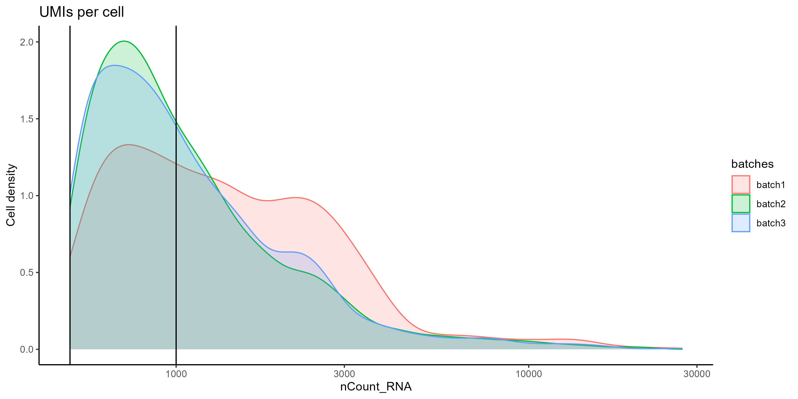

**Figure 4.** Density plot comparing the distibution of UMIs per cell between the samples. 


We also can plot the number of features (genes) per cell. Again, compare this plot to the Violin plot in Figure 3.

```R
# Visualize the distribution of genes detected per cell via histogram
day2somules_metadata %>% 
  	ggplot(aes(color=batches, x=nFeature_RNA, fill=batches)) + 
  	geom_density(alpha = 0.2) + 
  	theme_classic() +
  	scale_x_log10() + 
  	geom_vline(xintercept = 300)+
  	ggtitle("Genes per cell")
#ggsave(paste0("raw_genesPerCell_somules_v10_",st,".png"), width = 10, height = 5)
```

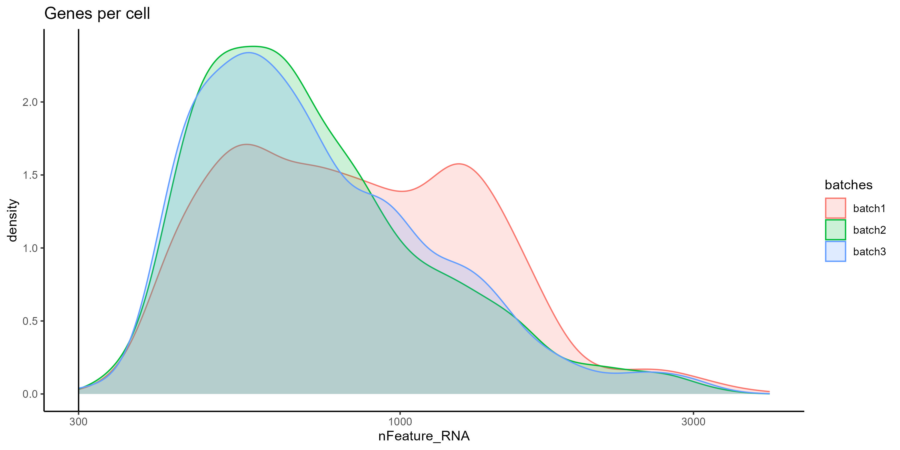
**Figure 5.** Density plot comparing the distibution of Features per cell between the samples.

However all samples show a similar correlation when we compare the count of features (genes) and UMIs (transcripts), additionally we can color the cells by percentage of mitochondrial RNA to see the overall quality of the sample. Cells with low UMI and feature counts and high percentage of mitochondrial RNA could correspond to apoptotic cells and should be removed.


```R
day2somules_metadata %>% 
  	ggplot(aes(x=nCount_RNA, y=nFeature_RNA, color=percent.mt)) + 
  	geom_point() + 
	scale_colour_gradient(low = "gray90", high = "black") +
  	stat_smooth(method=lm) +
  	scale_x_log10() + 
  	scale_y_log10() + 
  	theme_classic() +
  	geom_vline(xintercept = 1000) +
  	geom_hline(yintercept = 500) +
  	facet_wrap(~batches)
#ggsave(paste0("raw_cgenesVumis_mito_somules_v10_bybatch_",st,".png"), width = 10, height = 5)
```

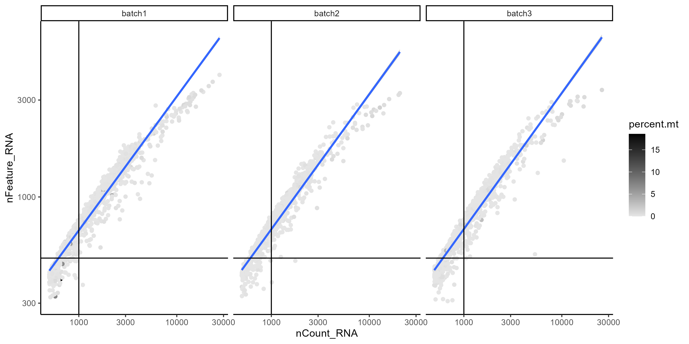
**Figure 6.** Correlation between feature (genes) and UMIs (transcript) counts per cell. Gray scale indicates the percentage of mito RNA.

### QC filtering

Now let's proceed to filter-out low quality cell. We will only keep cells with more than 500 transcripts and less 5% mitochondrial RNA 

This is a fairly permissive filtering - we may find some more low quality clusters later in the analysis.

```R

#subsetting the dataset
day2somules <- subset(day2somules, subset = nCount_RNA > 500 & percent.mt < 5)
dim(day2somules) #shows number of genes and number of cells

```

How many cells were removed in total and by batch?

### Save and start next analysis

Now that you have completed the QC filter, you can save your analysis in a R object.  

```R

saveRDS(day2somules, file = "day2somules_v10_firstfilt.rds") #saves this version of the dataset

```

If you had any issues later on, you can import R object here.

```R

day2somules <- readRDS(file = "day2somules_v10_firstfilt.rds")

```

[↥ **Back to top**](#top)

## 5. Data normalization and scaling <a name="normalization"></a>

### Classic Normalization <a name="classic"></a>

The classic normalization employs a global-scaling normalization method “LogNormalize” that normalizes the feature expression measurements for each cell by the total expression, multiplies this by a scale factor (10,000 by default), and log-transforms the result.


```R
day2somules <- NormalizeData(day2somules, normalization.method = "LogNormalize", scale.factor = 10000, assay = "RNA")
day2somules <- FindVariableFeatures(day2somules, selection.method = "vst", nfeatures = 2000, assay="RNA")

top10 <- head(VariableFeatures(day2somules,assay="RNA"), 10)
plot <- VariableFeaturePlot(day2somules, assay = "RNA")
plot <- LabelPoints(plot = plot, points = top10, repel = TRUE)

plot
```

**Figure 7.** Dot plot showing the Gene Variances  Top 10 variable genes.

```R
all.genes <- rownames(day2somules)
day2somules <- ScaleData(day2somules, features = all.genes, assay="RNA")
```

Normalized values are stored in day2somules[["RNA"]]$data

```R
head(day2somules[["RNA"]]$data[,1:20],n=20L)
```

### SCTransform the data <a name="SCTrasform"></a>

SCTransform normalises and scales the data, and finds variable features. It has some improvements from earlier versions of Seurat and replaces NormalizeData(), ScaleData(), and FindVariableFeatures()).

```R
# run sctransform
day2somules <- SCTransform(day2somules, assay="RNA", new.assay.name="SCT", verbose = TRUE)
```

The results of this is stored day2somules[["SCT"]]$data.

```R
head(day2somules[["SCT"]]$data[,1:20],n=20L)
```

[↥  **Back to top**](#top)

## 6. Perform dimentional reduction <a name='PCA'></a>

Principal component analysis (PCA) is a fundamental dimension reduction technique in analyzing single-cell genomic data. It maps the cells with high-dimensional and noisy genomic information to a low-dimensional and denoised principal component space.

```R
day2somules <- RunPCA(day2somules, features = VariableFeatures(object = day2somules), npcs=100,assay="RNA")
#shows the weightings of top contributing features to pcs 1 and 2
VizDimLoadings(day2somules, dims = 1:2, reduction = "pca") #shows the weightings of top contributing features to PCs 1 and 2
```

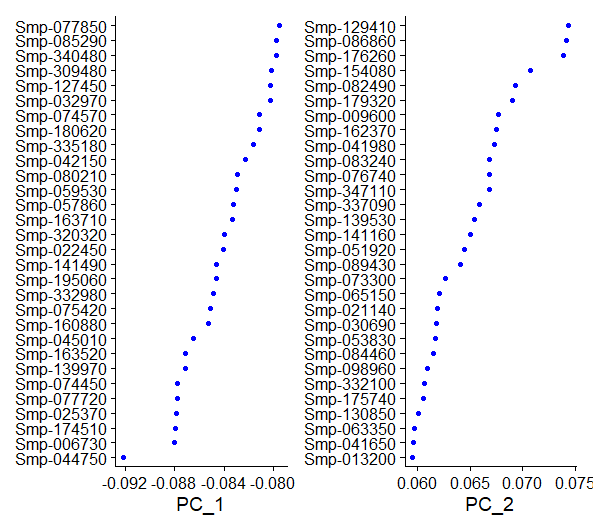
**Figure 8.** Top variable genes for 1st and 2nd PCs after the initial normalization and scaling.

We can also plot a heatmap to visualize the top features contributing to heterogenity in each PC. We will plot the expression for each feature in the top 500 cells in the exptremes of the spectrum.

```R
DimHeatmap(day2somules, dims = 1:3, cells = 500, assays="RNA", balanced = TRUE) 
```

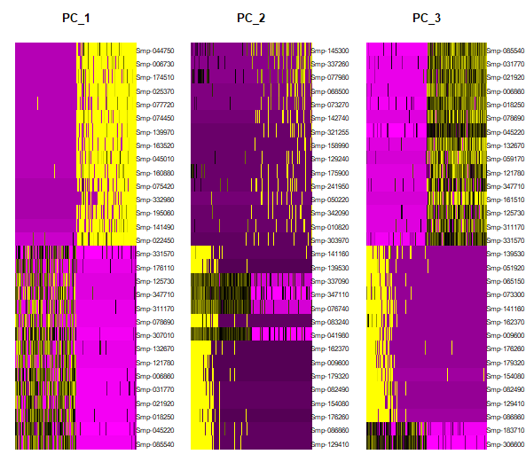

**Figure 9.** Heatmap showing the most contributing features in PCs 1 to 3 and the gene expression in the top 500 most variable cells (positive and negative)

[↥  **Back to top**](#top)

## 7. Determine the 'dimentionality' of the dataset <a name='dimentionality'></a>

The principal components (PCs) are then used to group cells into clusters. The number of PCs plays a critical role in downstream analyses. With too many PCs, PCs with the smallest variations may represent the noise in the data and dilute the signal. With too few PCs, the essential information in the data may not be captured. An optimal number of PCs should keep the essential information in the data while filtering out as much noise as possible.

It's possible to use JackStraw to randomly permute data in 1% chunks. Here with 100 replicates and for 100 PCs. However, it's too slow for this tutorial. 

```R
#day2somules <- JackStraw(day2somules, num.replicate = 100, dims =100) #do the permutation
#day2somules <- ScoreJackStraw(day2somules, dims = 1:100) #extract the scores
#JackStrawPlot(day2somules, dims = 1:100) #plot the p-vals for PCs. Dashed line giives null distribution
#ggsave("day2somules_v10_jackstrawplot100.pdf", width = 30, height = 15, units = c('cm'))
```
An elbow plot is a quick way to assess the contribution of the principal components to the variation. It starts from a scatterplot where the y-axis shows the standard deviations of PCs and the x-axis shows the numbers of PCs. Since the PCs are ordered decreasingly by their standard deviations, the scatterplot usually presents a monotonically decreasing curve that sharply descends for the first several PCs and gradually flattens out for the subsequent PCs.

```R
DefaultAssay(day2somules) <- "RNA"

ElbowPlot(day2somules, ndims = 100)  #ranks PCs by percentage of variation. A clear dropoff is sometimes seen, though not really here.
#ggsave(paste0("day2somules_v10_elbowplot100_",st,".png"))
```


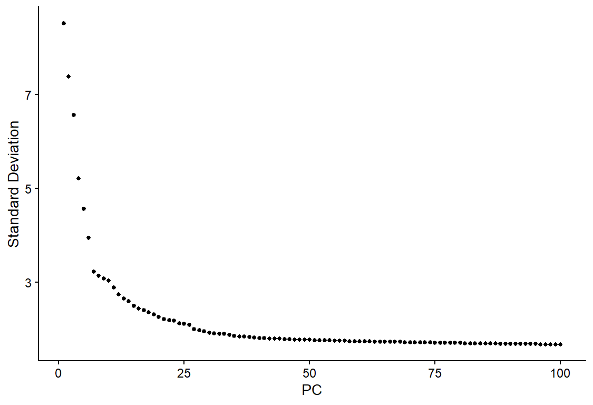
**Figure 10.** Elbowplot showing the proportion of variation captured by each PC

[↥  **Back to top**](#top)

## 8. Cluster the cells <a name='cluster'></a>

Seurat applies a graph-based clustering approach. Constructs a K-nearest neighbor graph based on the euclidean distance in PCA space, and refine the edge weights between any two cells based on the shared overlap in their local neighborhoods (Jaccard similarity). This step is performed using the FindNeighbors() function, and takes as input the previously defined dimensionality of the dataset (PCs).

```R
#here construct k-nearest neighbours graph based on euclidean distance in PCA space, then refine edge weights based on Jaccard similarity. this takes the number of PCs previously determined as important (here 40 PCs_)
day2somules <- FindNeighbors(day2somules, dims = 1:40)
```

To cluster the cells, we next apply modularity optimization techniques, to iteratively group cells together, with the goal of optimizing the standard modularity function. The FindClusters() function implements this procedure, and contains a resolution parameter that sets the ‘granularity’ of the downstream clustering, with increased values leading to a greater number of clusters.

```R 
#this iteratively groups cells using Louvain algorithm (default). Resolution sets the granularity. 0.4-1.2 gives good results for ~3K cells, with larger number suiting larger datasets.
day2somules <- FindClusters(day2somules, resolution = 0.5) 
```

[↥  **Back to top**](#top)

## 9. Run non-linear dimensional reduction <a name="umap"></a>

Seurat offers several non-linear dimensional reduction techniques, such as tSNE and UMAP, to visualize and explore these datasets. The goal of these algorithms is to learn underlying structure in the dataset, in order to place similar cells together in low-dimensional space. Therefore, cells that are grouped together within graph-based clusters determined above should co-localize on these dimension reduction plots.

```R

#runs umap to visualise the clusters. Need to set the number of PCs
day2somules <- RunUMAP(day2somules, dims = 1:40) 
#visualises the UMAP
DimPlot(day2somules, reduction = "umap") 
#ggsave(paste0("day2somules_v10clust_40PC_0.4res_SCT",st,".png"))

```

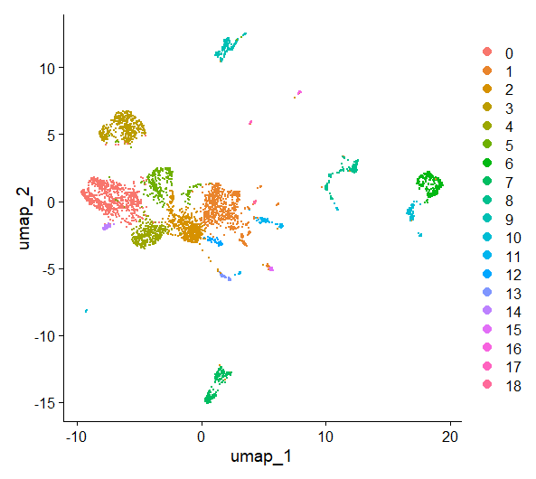

**Figure 11.** UMAP plot, cells are colored by cluster

### Plot metadata

Now we have a UMAP representation of our cells, we can also use that to visualise the metadata.
```R
DimPlot(day2somules, reduction = "umap", group.by = "batches", shuffle = TRUE) #visualises the UMAP
#ggsave("day2somules_v10_40PC_0.5res_after_one_filt_shuffled_batch_SCT.jpg")

```

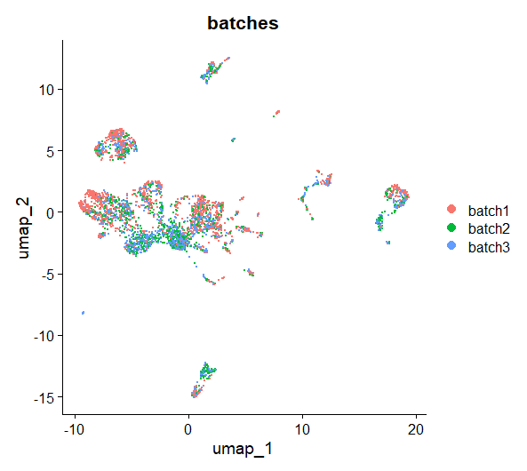
**Figure 12.** UMAP plot, cells are colored by batch

What do you notice once the UMAP is coloured by sample? Is there anything you might do about this?

```R
FeaturePlot(day2somules, features="percent.mt", label=TRUE)
#ggsave("day2somules_v10_40PC_0.5res_after_one_filt_mt_SCT.jpg")
```


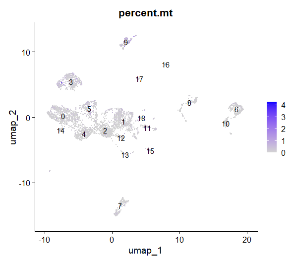
**Figure 13.** UMAP plot, cells are colored by percentage of mtRNA

What do you think about this figure? Is there any cluster with a higher proportion of MT RNA?

[↥  **Back to top**](#top)

## 10. Finding differentially expressed features (cluster biomarkers) <a name="biomarkers"></a>

We want to understand what the cell clusters might be. One approach to do that is find gene that are cluster markers - find differentially expressed genes that are descriptive of a cluster.

```R
day2somules<-JoinLayers(day2somules)

#day2somules.all.markers_roc <- FindAllMarkers(day2somules, only.pos = TRUE, min.pct = 0.0, logfc.threshold = 0.0, test.use = "roc") #We could search the markers for all clusters, however that would take too long.

day2somules.markers_roc_cluster0 <- FindMarkers(day2somules, ident.1 = 0, only.pos = TRUE, min.pct = 0.0, logfc.threshold = 0.0, test.use = "roc")
```
Import annotation information. I have collected this from the genome annotation file. 

```R
v10_genelist <- read.csv("v10_genes_with_descriptions_2023-04-17.csv", stringsAsFactors = FALSE, header = TRUE) 
v10_genelist$X <- NULL 
```

We can combine these files to see the information associated with our marker genes.

```R
day2somules.markers_roc_cluster0$gene <- rownames(day2somules.markers_roc_cluster0)
day2somules.markers_roc_cluster0$gene <- gsub('\\-', '_', day2somules.markers_roc_cluster0$gene) #replace dashes in gene id with underscores

day2somules.markers_roc_cluster0 <- day2somules.markers_roc_cluster0 %>% left_join(v10_genelist, by = c("gene" = "Gene.stable.ID")) #check the top 5 marker genes are also in the somule paper
write.csv(x=day2somules.markers_roc_cluster0, file=paste0('day2somules.markers_roc_cluster0_annotate_', st, '.csv')) #save this as a csv
```

An exercise: in your pairs, choose a cluster, and use the FindMarkers function to find the markers, and then use the gene information to have a go at predicting the tissue type of the cell cluster.

```{r, error=TRUE}

#put your code in here!
day2somules.markers_roc_cluster_ <- FindMarkers()

```

A brainstorm question: how might you use this list to choose a gene to use for in-situ validation? What attributes might you be looking for?

How else might you classify cell cluster tissue types?


### Explore the expression of specific genes in the UMAP <a name="plotGenes"></a>

Now we can look at gene expression in these data by gene, which could be useful to identify cluster marker genes. The example below shows you ago 2-1. If you want to look at a different gene, simply type the gene ID where "Smp-179320" currently sits. Remember to use - rather than _ ! We can visualise genes that we already know something about in the organism, to see if that gives us some clues
```R
FeaturePlot(day2somules, features = "Smp-179320")
#ggsave(paste0("day2somules-Smp-179320-",st, ".jpg"), width = 25, height = 15)
```
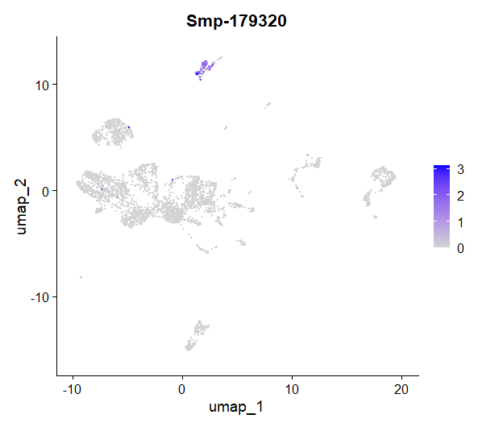
**Figure 14.** UMAP plot showing the expression of Smp_179320 (ago2-1) per cell

We can also look at these genes with a violin plot - this visualisation can be helpful in many ways, including seeing which clusters a gene is most expressed in.

```R
VlnPlot(day2somules, features = "Smp-179320")
#ggsave(paste0("day2somules-Smp-179320_",st, ".jpg"), width = 25, height = 15)
```
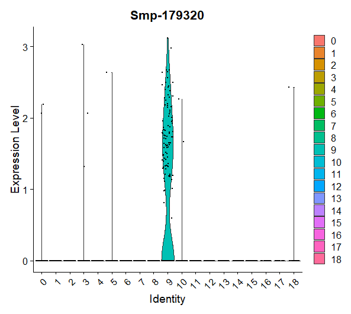
**Figure 15.** Violin plot showing the expression of Smp_179320 (ago2-1) per cluster

Are there any genes you're particularly interested in? You can adapt the code below to see if, and where, it might be expressed in these data. If you're not sure, you can look up _S.mansoni_ on WBPS and choose a gene from there (https://parasite.wormbase.org/index.html). Remember to delete the # if you want to save the plot to your computer!

```R
FeaturePlot(day2somules, features = "your_gene")
#ggsave(paste0("day2somules-your-gene_",st,".png"), width = 25, height = 15)
```
### Plot co-expressed genes

You can also look for co-expression - are two genes you're interested in expressed in the same cells?
```R
coexpression.plot <-FeaturePlot(day2somules, features = c("Smp-179320", "Smp-086860"), blend = TRUE)
coexpression.plot
#ggsave(paste0("day2somules-coexpressed-Smp-179320-Smp-086860-",st, ".jpg"), width = 45, height = 25)
```
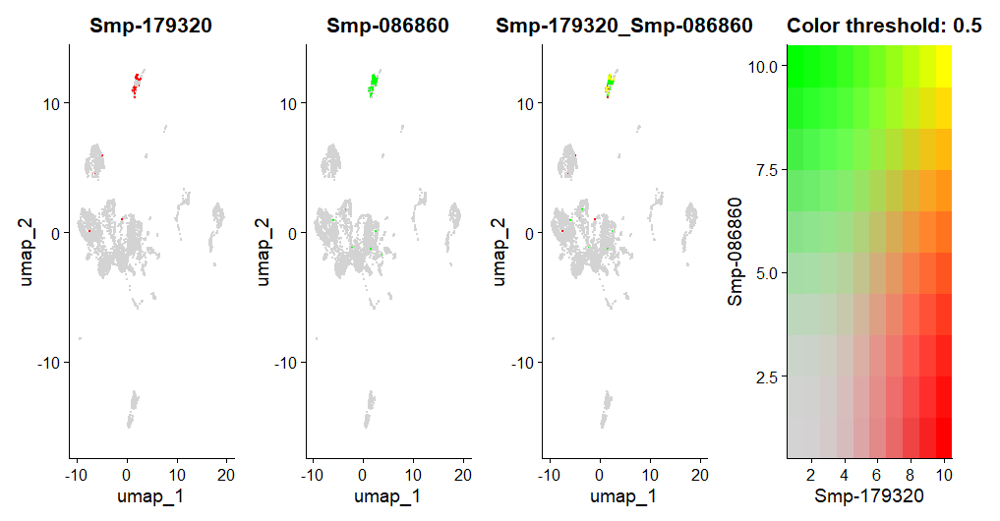
**Figure 16.** UMAPs showing the co-expression of Smp_179320 (ago2-1) and Smp_086860 (histone H2A) per cell 

Can you find a pair genes whose products you might expect to interact, and see if they are co-expressed? Again, you can use WBPS to learn more about genes.

```{r}
#put your code in here!
```

[↥  **Back to top**](#top)

## 11. Assigning cell type identity to clusters <a name="renameUMAP"></a>

You want all the cluster names to be unique - why might that be?
```R
day2somules <- RenameIdents(object = day2somules, 
                               "0" = "my.cluster0",
                               "1" = "my.cluster1",
                               "2" = "my.cluster2",
                               "3" = "my.cluster3",
                               "4" = "my.cluster4",
                               "5" = "my.cluster5",
                               "6" = "my.cluster6",
                               "7" = "my.cluster7",
                               "8" = "my.cluster8",
                               "9" = "my.cluster9",
                               "10" = "my.cluster10",
                               "11" = "my.cluster11",
                               "12" = "my.cluster12",
                               "13" = "my.cluster13",
                               "14" = "my.cluster14",
                               "15" = "my.cluster15",
                            "16" = "my.cluster16")

day2somules[["my.cluster.names"]] <- Idents(object = day2somules)
```

Now we can make a plot of the clusters with the IDs that we've chosen, and make it a bit fancier with a custom colour palette.
```R
new_pal <- c("#c4b7cb","#007aaa","#ffb703","#c40c18","#fb8500","#7851a9","#00325b","#8ACB88","#107E7D", "#FB6376", "#57467B", "#FFFD82", "#2191FB", "#690500", "#B3E9C7", "#B57F50","#2C514C","grey")
scales::show_col(new_pal)
plot1 <- DimPlot(day2somules, reduction = "umap", label = FALSE, repel = TRUE, label.box = FALSE) + NoLegend() +scale_color_manual(values = new_pal)
LabelClusters(plot1, id = "ident", color = 'black', size =4, repel = T,  box.padding = 1.75, max.overlaps=Inf)

#ggsave(paste0("day2somules-labelledlclusters_40PC_0.5res_",st,".jpg"), width = 25, height = 15)
```

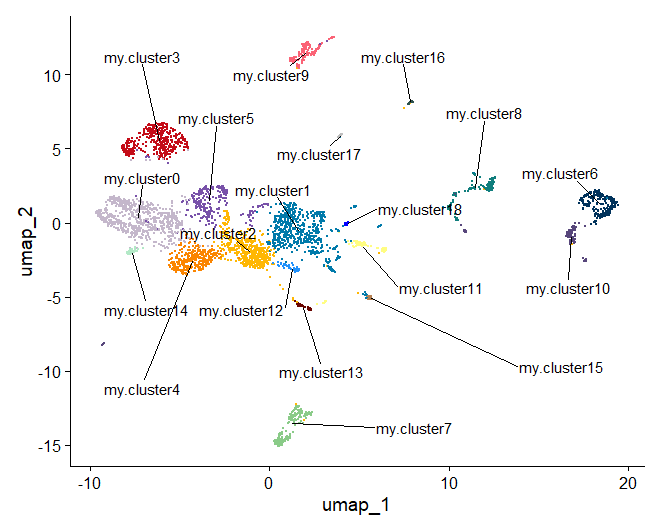
**Figure 17.** Once you have identified the cell types you can rename the clusters
