------------------------------------------------------------------------

# Bulk-RNAseq transcriptomics

## Author: A Protasio and W Wangwiwatsin

## Affiliation: University of Cambridge & Khon Kaen University

# Transcriptomics

## Table of Contents

1.  [Overview and Aims](#intro)
2.  [Introduction to transcriptome and experiment design](#basic)
3.  [Mapping RNA-seq reads to a reference genome](#mapping)
4.  [Counting the number of reads mapped to each gene](#readcount)
5.  [Import data into RStudio](#Rprep)
6.  [Visualising overview of transcriptomic data in R](#pca)
7.  [Identifying differentially expressed genes](#de)
8.  [Exploring gene expression using gene plots and heatmaps](#plots)
9.  [Functional analysis using GO term enrichment](#go)

## Overview and Aims <a name="intro"></a>

In this module, we will cover key concepts in RNA-seq transcriptome
experimental design and data analysis. We will start from raw data and
work toward analysis of differentially expressed genes and functional
analysis of gene lists. The example we will use come from *Schistosoma
mansoni* which we have a good reference genome for (and downloadable
from [WormBase
ParaSite](https://parasite.wormbase.org/Schistosoma_mansoni_prjea36577/Info/Index/)).
We will use *S. mansoni* data from experimentally-infected mice that
were collected at different time post-infection. We could ask if and how
the worms at different stages of development are transcriptionally
different and what does that tell us about the nature of these worms and
the infection they cause.

At the end of this module, you will have acquired hands-on experience
in - mapping RNA-seq data to a reference genome - acquiring read counts
results and import them to R - visualising transcriptomic profiles in
R - using R packages to identify differentially expressed genes and
finding patterns in the data - performing GO term enrichment and
interpret the results

[↥ **Back to top**](#top)

## Introduction to transcriptome and experiment design <a name="basic"></a>

Understanding when each gene is used helps us to investigate how
organisms develop and which genes are used in response to particular
external stimuli. The first layer in understanding how the genome is
used is the transcriptome. This is also the most accessible because like
the genome, the transcriptome is made of nucleic acids and can be
sequenced using the same technology. Arguably the proteome and
metabolome is of equal (and some would argeu even greater!) relevance to
understanding cellular biology. However, given the nature of proteins
and the matabolits in the metabolic pathways, these are more difficult
to profile.

Transcriptome profiling, also called *RNA-seq profiling*, using for
instance Sequencing-by-Synthesis method, has *de facto* displaced all
other technologies due to its low cost, versatility, dynamic range and
independence from a reference sequence (such as a genome or a known
gene) making it particularly attractive to the sequencing of
"neglected" non-modele organisms.

One of the most common uses of *RNA-seq profiling* is for differential
gene expression studies, which will be covered in this course. However,
the extensive and high-throughput nature of RNA-seq data means there are
other potential usages. For example, it can be used to profile total RNA
(e.g. miRNA and mRNA) in exosomes and other secretory products; help
identify different splice isoforms; provide evidence for gene annotation
and improve quality of reference genomes. Meta-transcriptome, the
combinations and re-analysis of a pool of transcriptomics data from
multiple experiments, and comparative gene expression between species
could be seen as an extension of differential gene expression.
Furthermore, genetic variation particularly SNP calling could use
information from transcriptomics data which would carry SNPs from
transcribed genes.

### Designing a transcriptome experiment: things to consider

#### Replicates and power

To reliably identify which genes are differentially expressed and by how
much, it is essential to use replicated data. In biological research,
repeating experiments is critical—doing it once is not enough. There is
no single answer to how many replicates are needed, as this depends on
balancing statistical power with practical constraints like time and
cost. Replicates help us measure the natural variation that occurs
during sample preparation and sequencing, allowing for more accurate
conclusions. Importantly, these should be biological replicates, i.e.
independent samples from different individuals or conditions, rather
than technical replicates of the same sample.

*Technical replicates: random noise from protocols or equipment* \*
multiple measurements from the same biological sample e.g. sequencing
the same library on multiple lanes, same sample is sequenced multiple
times \* do not account for the variability that really exists in
biological systems or the experimental error between batches of
parasites \* The noise from technical variation is often quite low.

*Biological replicates: “true” biological variation* \* From independent
and distinct individual/cells/experiments e.g. growing up three batches
of parasites, treating them all identically, extracting RNA from each
and sequencing the three samples separately, cells that are grown
separately (although, this is arguable for cell lines), individual plants, etc. 

*How many replicates to do?* \* The number of replicate affect
statistical power in identifying differentially expressed genes \* More replicates will help improve power for genes that are already detected at high levels, while deeper sequencing will improve power to detect differential expression for genes which are expressed at low levels. \* For differential expression analysis, most published RNA-seq papers use 3 replicates \* However, some studies suggest at least 6 replicates, and that 12 replicates would allow reliable detection of lowly expressed genes or
genes with small changes between conditions \* If your are able to
choose, go for more replicates rather than high number of reads.

#### Numbers of reads

The table below shows general recommendation according to Genohub, but
real usage can vary depending on your needs. You may recall from the
Genetic Diversity module that reduced number of reads, in some cases,
can still provide information about genetic variations. If the
differences between groups are big, then you may still see the
differences even when your have a low number of reads. If the
differences are small, however, those small differences may get lost
amongst the noises and sample-to-sample variations, such that you will
need a higher number of reads to see the biological signals. (For more
details, refer to
[Genohub](https://genohub.com/next-generation-sequencing-guide/#depth2)

| Sample type | Reads recommended for differential expression (millions) | Reads recommended for rare transcript or de novo assembly (millions) |
|------------------------|------------------------|------------------------|
| Small genomes (e.g. bacteria, fungi) | 5 | 30-65 |
| Intermediate genomes (e.g. Drosophila, C. elegans, most helminths) | 10 | 70-130 |
| Large genomes (e.g. human, mouse) | 15-25 | 100-200 |

#### Controls and other confounding factors

Although transcriptomes have so much potential, results interpretation
relies on good experimental design; therefore, in the same way as any
good experimental design, always think about “control” samples and
consider any confounding factors.

Samples are often processed in batches, or if you have many samples or
require large amount of output data, they may need to be sequenced on
multiple lanes. For this, think about a way to group samples to minimise
“batch effect”. See diagram below:

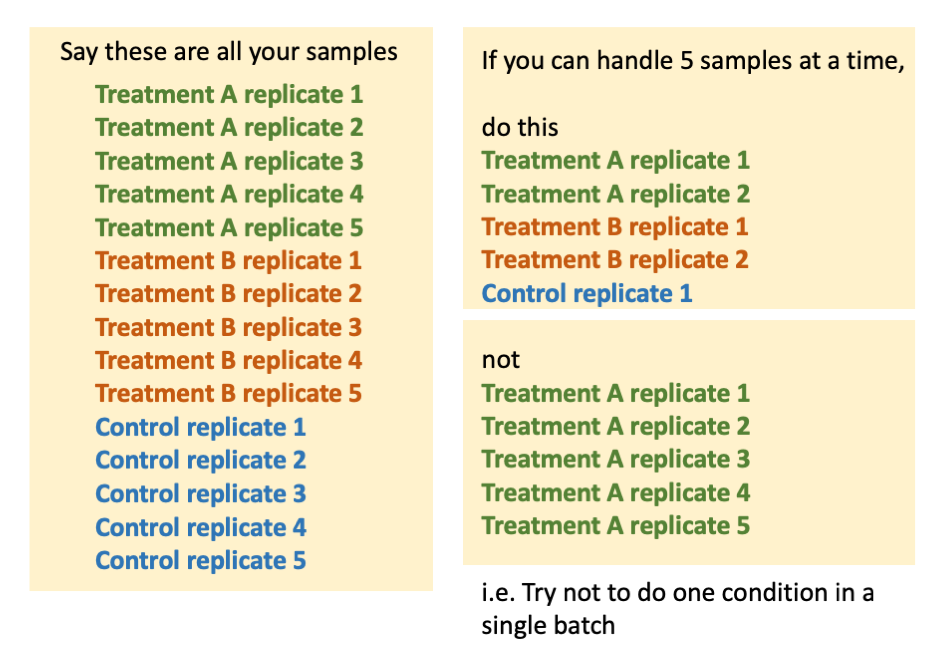\
**Figure 1.** Avoiding batch effect

*Thinking beyond these notes*

Consider this experimental design.

Joseph is your doctoral student. He wants to investigate the effect of
adding a type of drug on the development of larvae. They would like to
test the hypothesis that the worms will grow slower at the end of one
day of treatment. He's what they propose:

| Sample Type | Sample name | Time point (hours) | drug treatment |
|-------------|-------------|--------------------|----------------|
| Experiment  | 1.1         | 12                 | yes            |
| Experiment  | 1.2         | 12                 | yes            |
| Experiment  | 2.1         | 24                 | yes            |
| Experiment  | 2.2         | 24                 | yes            |
| Experiment  | 3.1         | 1                  | no (baseline)  |
| Experiment  | 3.2         | 1                  | no (baseline)  |
| Control     | A.1         | 1                  | no             |
| Control     | A.2         | 1                  | no             |
| Control     | B.1         | 12                 | no             |
| Control     | B.2         | 12                 | no             |
| Control     | C.1         | 24                 | no             |
| Control     | C.2         | 24                 | no             |

As their supervisor, would you agree with this experimental design? Why?

Unfortunately, you need to give Joseph some bad news: "There are enough
reagents to produce only 10 samples!". You ask them to reconsider the
design. Here's what they come back with adding that they will leave one
sample's worth reagents just in case something goes wrong.

Would you agree with this new design? Why?

| Sample Type | Sample name | Time point (hours) | drug treatment |
|-------------|-------------|--------------------|----------------|
| Experiment  | 1.1         | 12                 | yes            |
| Experiment  | 1.2         | 12                 | yes            |
| Experiment  | 2.1         | 24                 | yes            |
| Experiment  | 2.2         | 24                 | yes            |
| Experiment  | 3.1         | 1                  | no (baseline)  |
| Experiment  | 3.2         | 1                  | no (baseline)  |
| Control     | A.1         | 1                  | no             |
| Control     | B.1         | 12                 | no             |
| Control     | C.1         | 24                 | no             |

If not, can you propose an new design that generated the data needed for
to test the hypothesis while keeping the samples to a max of 10?

#### Strand-specificity

Current protocols for preparing RNA-seq libraries, combined with the
correct read mapping algorithms, retain information that can be used to
correctly allocate a sequence to one or other DNA strand in the
reference. This *strand information*, in addition to sequences, could be
particularly useful if researchers are interested in non-directional,
unannotated non-coding RNAs or if the organisms under study is known to
have genes overlapping on the opposite strands. See more explanation
with diagrams
[here](https://www.azenta.com/blog/stranded-versus-non-stranded-rna-seq)

#### Single-end or paired-end sequencing

In single-end sequencing, each fragment is sequenced from only one end.
In paired-end sequencing, the sequencing is done on both ends of the
fragment, providing information on relative positions of each pair of
sequencing reads. Single-end sequencing is faster to obtain as well as
more economical, and it can be a good choice for sequencing of small
RNA.

Paired-end data could enable more accurate read mapping (alignment) to
the genome, and it is particularly useful for detecting genomic
rearrangements, insertion-deletion (indel), identify splice isoforms, or
work with repetitive sequence elements.

*Thinking beyond these notes*

-   Can you exlpain why pair-end sequencing is better at read mappig or identifying indels? Draw a diagram to explain you argument.

[↥ **Back to top**](#top)

## Now for your hands-on data analysis

We will use data of *S. mansoni* from experimentally-infected mice that were collected at different time post-infection. These are worms from the lung stage (day 6 after the infection), the liver stage (day 13, 17, 21 after infection), and the adult stage (day 28 when they look like adults, and day 35 when the egg-laying has started and liver pathology can be noticable). Most groups have three biological replicates, except for the lung stage (day-6) where there are 7 biological replicates. Therefore there are 22 RNA samples, each has been sequenced on an Illumina HiSeq sequencing machine. All were sequenced as paired-end.

## Mapping RNA-seq reads to a reference genome

Mapping RNA-seq data typically requires substantial computing power and is often performed on a high-performance computing cluster or in the Cloud. It can take several hours to process each sample. For the
purposes of this demonstration, we are using datasets with a reduced
number of reads to shorten the runtime while still allowing you to
observe what a typical run looks like. We also provide the output of a mapping run using the full dataset, which we will use for differential expression analysis later this afternoon.

To begin, we will use
[HISAT2](https://pubmed.ncbi.nlm.nih.gov/25751142/) to align RNA-seq
reads (in FASTQ format) to a reference genome (in FASTA format). HISAT2
is a fast and memory-efficient RNA-seq aligner developed as a successor
to TopHat. It is well suited for eukaryotic transcriptomes because it
accounts for exon-intron splicing events, a key feature of mRNA in these
organisms.

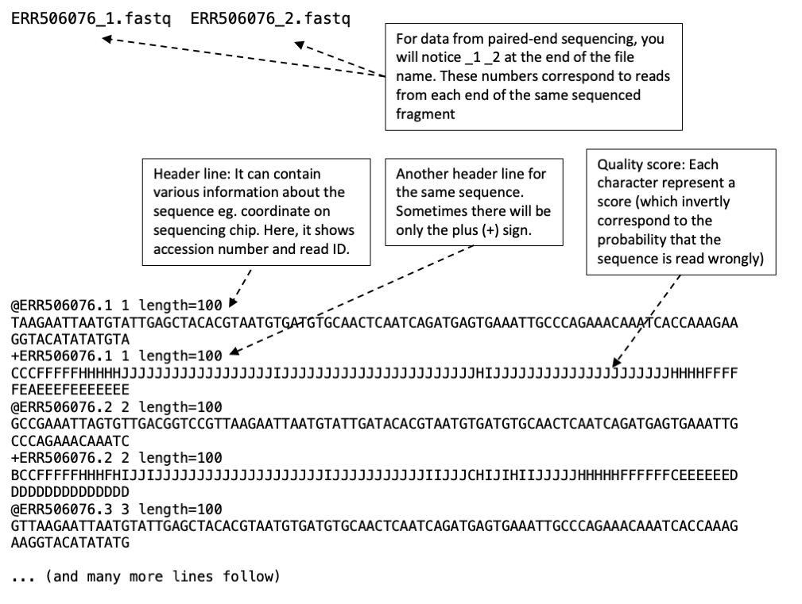\
**Figure 3.** Example of a FASTQ file.

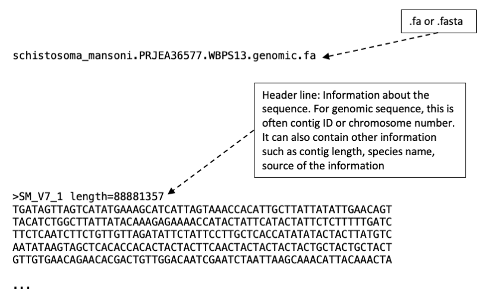\
**Figure 4.** Example of a FASTA file.

**Note:** For RNA-seq we can often get away without trimming reads
before the mapping step. This is because contaminated reads or reads
with low-quality would also have low mapping score and will be excluded
during the read counting step. However, if the number of mapped reads or
mapping results seem off, you may want to look at QC (quality control) of the raw read
data to figure out where things might have gone wrong.

Use the following command on your Terminal window.

-   **Some example command lines will need to be changed to fit your
    computer setting**

-   **if you see `/some/text/like/this` just copy-paste will not work**

-   **Remember to use TAB for auto-completion**

``` bash
# Go to the location of the reference genome
cd ~/Transcriptomics/References_v10/

# Index reference genome so that it can be read by HISAT2
# The template syntax for indexing command is hisat2-build <reference genome in .fa> <prefix for the index file>
hisat2-build schistosoma_mansoni.PRJEA36577.WBPS18.genomic.fa schistosoma_mansoni.PRJEA36577.WBPS18.genomic.hisat2idx

# ...Wait for the indexing step. This will take about 5-10 minutes... while this is happening, check out more details about mapping below. 
```

After the experiment has been conducted, RNA extracted, and processed
for sequencing, each of the sequences obtained is called a “read”. The
sequences (or reads) are accessible via compressed FASTQ files which
could be many gigabytes in size! This is essentially our raw data for
the transcriptome analysis. The very first thing we could do with the
data is to QC it, that is to check the queality of the data against some pre-defined parameters. 
Then, we map it to the genome and, for gene expression analysis, count
the number of reads that map to individual gene locations.

### Key aspects of RNA-seq mapping and counting

Mapping is a relatively straightforward step, and below are information
that may become helpful when choosing tools and parameters during your
read mapping.

#### Spliced mapping

Eukaryotic mRNAs are processed after transcription; introns are spliced
out. Therefore some reads (those crossing exon boundaries) should be
split when mapped to the reference genome sequence in which intron
sequences are still present. TopHat and HISAT2 are one of few mappers
which can split reads while mapping them, making it very suitable for
mapping RNA-seq of a eukaryote. Splice-aware mapper first identify reads
that map within a single exon and then identify splice junction on
unmapped reads and map them across exon boundaries.

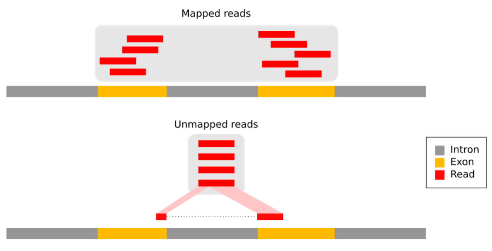\
**Figure 2.** How spliced mapping works (From
<https://galaxyproject.github.io/training-material/topics/transcriptomics/tutorials/ref-based/tutorial.html#mapping>)

#### Non-unique/repeated mapping regions

A sequence read may map equally well to multiple locations in the
reference genome. However, if we are counting reads as a proxt for mRNA
abundance, we would very much prefer the algorithm to decide for one
location or another. Different mapping algorithms have different
strategies to resolve this problem, so be sure to check the options
ingiven by the algorithm you are using. Some genomes are more difficult
than others, for example *Plasmodium falciparum* has a low GC content
(19% GC), which means that reads are more likely to map to multiple
locations in the genome by chance due to the low complexity. Reads from
genes with tandem repeat domains may also encounter this situation.

*Thinking beyond these notes* Do you know the proportion of repetitive
sequences in the genome of your favourite parasite? How do you think
this would influence the mapping of RNAseq reads to the genome? And if
you were doing a re-sequencing with the purpose of finding SNPs?

#### Insert size

When mapping paired-end reads, the aligner considers the expected insert
size—the average distance between the paired reads. For example, if the
expected insert size is around 200 nucleotides and each read is 50
nucleotides long, the gap between the reads should be approximately 100
nucleotides. If the mapped reads are much farther apart than expected,
the aligner may flag them as unreliable and discard them. Filtering out
such poorly aligned reads helps improve the overall accuracy of the
mapping.

#### Choosing the right aligner.

Mapping to a reference genome is particularly useful when genome
annotations are incomplete or unreliable, or when alternative transcript
isoforms are rare or unannotated in your organism. For eukaryotic
RNA-seq data, splice-aware aligners such as
[TopHat2](https://genomebiology.biomedcentral.com/articles/10.1186/gb-2013-14-4-r36),
[HISAT2](https://pmc.ncbi.nlm.nih.gov/articles/PMC4655817/),
[STAR](https://pmc.ncbi.nlm.nih.gov/articles/PMC3530905/), and
[GSNAP](https://pmc.ncbi.nlm.nih.gov/articles/PMC2844994/) are well
suited, as they can detect splicing events and align reads across
exon-intron boundaries.

In contrast, short-read mappers that do not account for splicing—such as
[BWA](https://pmc.ncbi.nlm.nih.gov/articles/PMC2705234/), and
[Bowtie2](https://pmc.ncbi.nlm.nih.gov/articles/PMC3322381/)—may be more
appropriate for prokaryotic organisms, where transcripts typically lack
introns and splicing is not a concern.

If you have a good quality genome and genome annotation—such as for
human, model organisms (e.g. mouse, zebra fish, *C. elegans*), and
well-curated pathogen genomes (e.g. Plasmodium, *S. mansoni*,
*Haemonchus contortus*)—you can map RNA-seq reads to the transcriptome
instead of the genome. This approach can save substantial time and
computing resources. Tools suitable for transcriptome-level mapping
include [Kallisto](https://www.nature.com/articles/nbt.3519), which
employs a pseudo-mapping approach, and
[eXpress](https://pmc.ncbi.nlm.nih.gov/articles/PMC3880119/).

However, this method comes with limitations. It depends entirely on the
gene models being accurate, which in turn requires a high-quality
reference genome. In contrast, genome-based mapping allows you to assess
mapping quality and check how well reads align with gene models using
genome viewers (such as Artemis, Apollo, IGV)—a step not possible with
transcriptome-only mapping.

New mapping tools continue to emerge, reflecting improvements in
algorithms and computing, as well as the evolution of sequencing
technologies. For example, long-read data from third-generation
sequencers often require different tools. While the technologies and
tools may change, the key concepts of mapping and sequence analysis
remain fundamental.

``` bash
# Once the genome indexing is done, follow the steps below to prepare your working directory. In a usual experiment, you will be generating multiple files at and after the mapping step. It is a good practice to keep a good structure for these files.
# Exit the 'References' directory and create a new directory to keep the mapping output
cd ../
mkdir Mapping

# Enter your new directory
cd Mapping
```

Now we will map RNA-seq data to the reference genome using HISAT2. As
mentioned before, the RNA-seq data for our data analysis in R have been
mapped for you separately, this part is only for practicing purposes.
Try `hisat2 --help` to find out what the additional arguments mean.

``` bash
# For RNA-seq that come from paired-end sequencing
hisat2 --max-intronlen 40000 -x ../References_v10/schistosoma_mansoni.PRJEA36577.WBPS18.genomic.hisat2idx -1 ../RNAseq_rawdata/ERR3489994_1_sample.fastq -2 ../RNAseq_rawdata/ERR3489994_2_sample.fastq -S ERR3489994.sam
```

The **alignment rate** will be shown on the screen. - What do you think
about the alignment rate of this mapping? - In which scenerio might you
get a low alignment rate in mapping of helminth sequences?

HISAT2 outputs a SAM file which contains information of the read's
mapping location in the reference and their scores. We will convert this SAM file to a BAM file,
a binary sibling which takes less space on a disk and allows faster
processing time for the next step (sorting).

``` bash
# Convert SAM to BAM using samtools
samtools view -bS -o ERR3489994.bam ERR3489994.sam

# Notice the file size differences between the SAM and BAM files
ls -lth

# Sort BAM file
samtools sort -n -O BAM -o ERR3489994_sorted.bam ERR3489994.bam
```

### Exercise 1

Now that SAM files have been converted to BAM, the SAMs are no longer
useful and they take up a lot of space. Use Unix commands to:

1)  List all SAM files, and only SAM files, in the current directory

2)  Remove all SAM files. *Make sure you do not accidentally delete BAM
    files; BAM files are needed for the next step!*

[↥ **Back to top**](#top)

## Counting the number of reads mapped to each gene

Now we have the mapping output as BAM file. This explains where on the
genome do each of the sequencing reads mapped to. Next we can combine
this information with a file that says which location on the genome is
what gene, a GFF or GTF file.

### Annotation files

The file that contains information about the location of genomic
features is tyically called "annotation" and it is formatted as GFF
(General Feature Format) or GTF (General Transfer Format). Each line of
the annotation file containing one bit of information about a given
feature. The information is displayed in tab-separated fields. Both file
types contain similar information but their formats are slightly
different (more details:
<http://m.ensembl.org/info/website/upload/gff.html>). Some software can
take either type as input. For software that asks for a specific type,
they can be converted using a tool such as `gffread`
([link](https://ccb.jhu.edu/software/stringtie/gff.shtml))

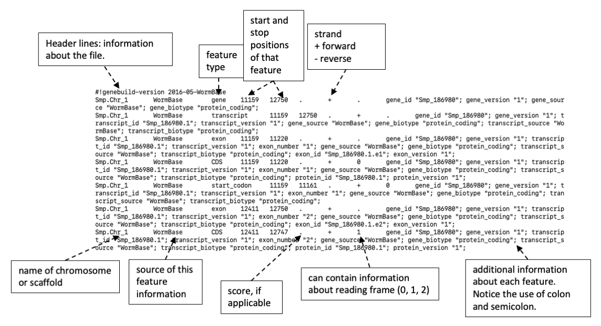 **Figure 5.** Example of a GTF file

We will use `featureCounts` from the Subread/Rsubreadpackages to
calculate the number of reads mapped to each gene. `featureCounts` had
many advantages for example, it's super fast and it can combine many BAM
file results in one simple final table. See
<https://subread.sourceforge.net/featureCounts.html> or type
`featureCounts --help` in your Unix console to display the full list of
options. The manual and `--help` option can also be useful if you
encounter an error message.

``` bash
# First, unzip the GTF file so that it can be read by featureCounts
# Go to Reference_v10 directory which is where the file is kept
cd ../References_v10/

ls  # you should see a file called schistosoma_mansoni.PRJEA36577.WBPS18.annotations_longestisoform.gff3

# Go back to Mapping directory
cd ../Mapping/

# Run featureCounts
# featureCounts <various options> <sorted BAM file> <GTF or GFF file with gene annotation>
# For ERR3489994_sorted.bam file
# The -o option is for the name of output file
featureCounts -p -B -t 'CDS' -g 'Parent' -T 1 -a ../References_v10/schistosoma_mansoni.PRJEA36577.WBPS18.annotations_longestisoform.gff3 -o ERR3489994_featureCounts.txt ERR3489994_sorted.bam

# Explore one of the featureCounts output files
# Use up-down arrows to move up and down the files, or press the spacebar or D to move down a page, press B to move up a page
less ERR3489994_featureCounts.txt

# Cut only column 'GeneID' and readcounts
cut -f1,7 ERR3489994_featureCounts.txt | head # Notice the output of this first part of the command

# Now pipe that output into another cut command
cut -f1,7 ERR3489994_featureCounts.txt | cut -d':' -f2 > ERR3489994_Counts.txt

less ERR3489994_Counts.txt
```

Output from featureCounts contain `STDOUT` (standard out; telling
progress and key steps while the tool is running) and `STDERR` (standard
error; error or warning messages) followed by the number of reads that
mapped to each gene. We only need the read count information for
downstream analyses.

``` bash
# Create a directory called “final_counts” to keep count files
mkdir final_counts

# Filter featureCounts output files into a new file, keeping just the lines with gene IDs (Smp for S. mansoni) and their read counts 
grep "^Smp" ERR3489994_Counts.txt

# That output way too much stuff on the screen, try `head` command to output just the first 10 lines
grep "^Smp" ERR3489994_Counts.txt | head 

# What we want here is to grep lines that start with Smp from a file, then sort the grep output, write this sorted output to a new file
grep "^Smp" ERR3489994_Counts.txt | sort > final_counts/ERR3489994_featureCounts.final.txt

less final_counts/ERR3489994_featureCounts.final.txt
```

We should now have files containing the number of reads mapped to each
gene within each demo samples. Next step, we will import read count data
into R and run differential expression analysis.

We mapped and performed read counting for two example samples so far,
the real samples have been done for you and are in a directory called
`RNAseq_featureCounts`. 

[↥ **Back to top**](#top)

## Setting up RStudio

We’ll now transition from Unix commands to working in R. While it’s
possible to run R in the Terminal, it’s much more convenient to use
RStudio, which provides a graphical user interface and organises scripts
and outputs within a single window.

Start by opening RStudio and creating a new R Script (or an R Markdown
file if preferred). A blank editor will open in the top-left pane. Save
the file with a meaningful name. As you work through the analysis, type
or copy commands from this handbook into the script editor. You can run
lines by selecting them and clicking the Run button, or by pressing
`Ctrl + Enter`. Keeping your code in a script makes it easier to review,
repeat, modify, or debug your analysis later.

RStudio also offers helpful tools for learning and troubleshooting: •
Use `?functionname` to open the help page for a specific function. • Use
`??functionname` to search for related functions if you’re unsure of the
exact name.

For additional support, online forums can be invaluable. Many common R
and bioinformatics issues have already been asked—and answered—on
platforms like <https://www.biostars.org/> or
<https://stackoverflow.com/>.

 **Figure 6.** RStudio user interface

### Prepare your R workspace

Most of the packages that we will load have previously been installed on
the computer, and now we need to load them, using the `library()`
command, into our current R environment.

**Note:** If you want to run this analysis on a different computer, you
may need to first install the packages, but this task is often
straightforward. R packages that we use are available from
[**Bioconductor**](https://www.bioconductor.org/) or from [**CRAN The
Comprehensive R Archive Network**](<https://cran.r-project.org/>.

As an example, to install `topGO`, which is an R package on
Bioconductor, we just need to follow a few lines of code from this page
<https://www.bioconductor.org/packages/release/bioc/html/topGO.html>. To
install a package from CRAN, such as `ggplot2`, we use command
`install.packages("ggplot2")`.

Today, we will also practise installing some of the required packages as
well.

Let's get your R workspace set up:

``` r
# Set up work directory
# setwd command sets the working directory for the current R session. After running this line, if we import or export files without defining a specific directory (i.e. full or relative path), R will assume the current working directory as your destination.
# The **path to your data (location of your data on the machine)** is considered a "string" or "character" in R, so we need to put it inside a quotation mark
setwd("/FULL_PATH/Transcriptomics/")

## note: FULL_PATH above refers to the folder structure that direct R to the foler "Transcriptomics" (R `setwd` is equivalent to unix `cd`) 

# Load required packages into R environment 
# R comes with standard packages (i.e. set of tools). We use the library command to load additional tools that we need for RNA-seq data analysis.
# Run the commands below, but some of the packages have not been pre-installed for you. 

# Notice how the 'library()' command respond; can you tell which of the packages have not been installed? 

library(DESeq2)          # for doing expression analysis
library(topGO)           # for running GO term enrichment
library(ggplot2)         # for (visually pleasing) plots
library(RColorBrewer)  # for a wider range of plot colours
library(pheatmap)        # for (visually pleasing) heatmaps

# Try installing the missing package(s) by following R package repository guideline. You usually need to do this step only once for each package on a given computer, unless essential version update is required.
# !!HINT!! Google the package name with the keyword "install". Follow the link to either the Bioconductior or CRAN websites.  
___your package installation command here___

# Once you have installed the missing package(s), run the library() command on those newly-install package(s) again. Notice how the command responds this time. 
___your library command here___

# To check which packages have been loaded to your current R working environment, check with command below
sessionInfo()
```

### About DESeq2

[DESeq2](https://genomebiology.biomedcentral.com/articles/10.1186/s13059-014-0550-8)
is by far the most popular R package for performing differential
expression analysis. It can take read count data in various forms, one
of those is read count tables from featureCounts. The tool provides
simple command lines for formatting read count data, normalisation,
exploring variances between samples, and performing differential
expression analysis. An excellently written detailed manual can be found
[here](http://bioconductor.org/packages/devel/bioc/vignettes/DESeq2/inst/doc/DESeq2.html)

### Alternative softwares

In addition to `DESeq2`, there are a variety of programs for detecting
differentially expressed genes from tables of RNA-seq read counts. Some
of these tools work in R, while some require Unix interface. Examples of
these tools include [EdgeR](https://pubmed.ncbi.nlm.nih.gov/19910308),
[BaySeq](https://pubmed.ncbi.nlm.nih.gov/20698981),
[Cuffdiff](https://pubmed.ncbi.nlm.nih.gov/23222703),
[Sleuth](https://pubmed.ncbi.nlm.nih.gov/28581496) (an accompanying tool
for read count data from Kallisto).

## Import read count data into R

We will tell R where the read count data is kept, and then create a
table with metadata of our samples. The format of the metadata table
will change with the tools that you use. What is demonstrated here is
for DESeq2.

``` r
# Tell the location of the read count files
# Create a datadir object to keep the path to the directory RNAseq_featureCounts in your module transcriptomics files
datadir <- "/FULL_PATH/Transcriptomics/RNAseq_featureCounts/" 

# list files in this directory, output as an R vector
list.files(datadir)   # this should list 22 files
sampleFiles <- list.files(datadir)    # this save that 22 file names into a new R object        

# Create sample names
# split the name at “_v10.count” and keep the resulting output in a new vector
name <- unlist(strsplit(sampleFiles, split = "_v10.count", perl = TRUE))
name

# Create metadata information - match with sample names
condition <- c(rep("D06",7), rep("D13",3), rep("D17",3), rep("D21",3), rep("D28",3), rep("D35",3))
replicate <- as.character(c(1,2,3,4,5,6,7, rep(c(1,2,3),5)))

# Put together into a metadata table called sampleTable
sampleTable <- data.frame(sample_name = name, file_name = sampleFiles, condition = condition, replicate = replicate)
sampleTable
```

Next, we will use the metadata to create an object in R that DESeq2 can
use

``` r
# Create DESeq2 object from read count files and sample metadata information 
# design =~ condition indicates which variable(s) in sampleTable represent experimental design. In this case, it is the condition column.
ddsHTSeq <- DESeqDataSetFromHTSeqCount(sampleTable = sampleTable, directory = datadir, design =~ condition)

# Apply normalisation and statistical model to the read count data 
# dds contain normalised counts, which can be access by counts(dds, normalized = TRUE)
# The output message denotes steps that this DESeq function performs. One of the steps is estimation of size factors which is the normalisation for differences in the total number of reads of the samples. Details can be found by typing ?DESeq.  
dds <- DESeq(ddsHTSeq)
```

### Normalisation

The raw read counts produced by HTSeq-count are not immediately suitable
for comparing gene expression levels and must first be normalised. This
is because read counts can be influenced by various factors—not just the
actual expression level of a gene (which is usually of most
interest)—but also by gene length, the total sequencing depth of each
sample, and the overall expression landscape of the sample.
Normalisation helps to account for these variables. You can find
detailed information about the normalisation approach used by DESeq2 in
the [official
vignette](http://bioconductor.org/packages/devel/bioc/vignettes/DESeq2/inst/doc/DESeq2.html).

For exploratory analyses such as principal component analysis (PCA),
results can be skewed by genes with very high or very low counts. To
address this, it’s common to apply a logarithmic transformation to the
normalised counts. DESeq2 provides the `rlog` (regularised log)
transformation for this purpose.

``` r
# Transform normalised read counts into log value 
rld <- rlogTransformation(dds, blind = FALSE)
```

[↥ **Back to top**](#top)

## Visualising overview of transcriptomic data in R

We will use exploratory analyses and plots to have an overview of our
dataset before digging into gene-level details.

### Principal Components Analysis (PCA)

The Principal Components Analysis plot shows the relationship between
the samples in two dimensions. Hopefully, technical and biological
replicates would show similar expression patterns (i.e. they are grouped
together tightly on the PCA plot); whereas, samples from different
experimental conditions, or distinctive time points, would form separate
groups. In this case, day-6 worms, liver stage worms, and adult worms
are separated from one another. The replicates are more similar to each
other than they are to samples from the different condition. In some
cases we can identify outliers, e.g. samples which do not agree with
other replicates and these can be excluded. If we don’t have many
replicates, it is hard to detect outliers and our power to detect
differentially expressed genes is reduced.

`plotPCA` is a function in DESeq2 package. R also have internal PCA
function, but the usage is more complicated `intgroup` indicate how we
want to present each data point on the plot. In this case, we label data
points based on their groups under the column `condition` of the
`sampleTable`

``` r
# Create PCA plot 
plotPCA(rld, intgroup = c("condition"))
```

You should get something similar to this. 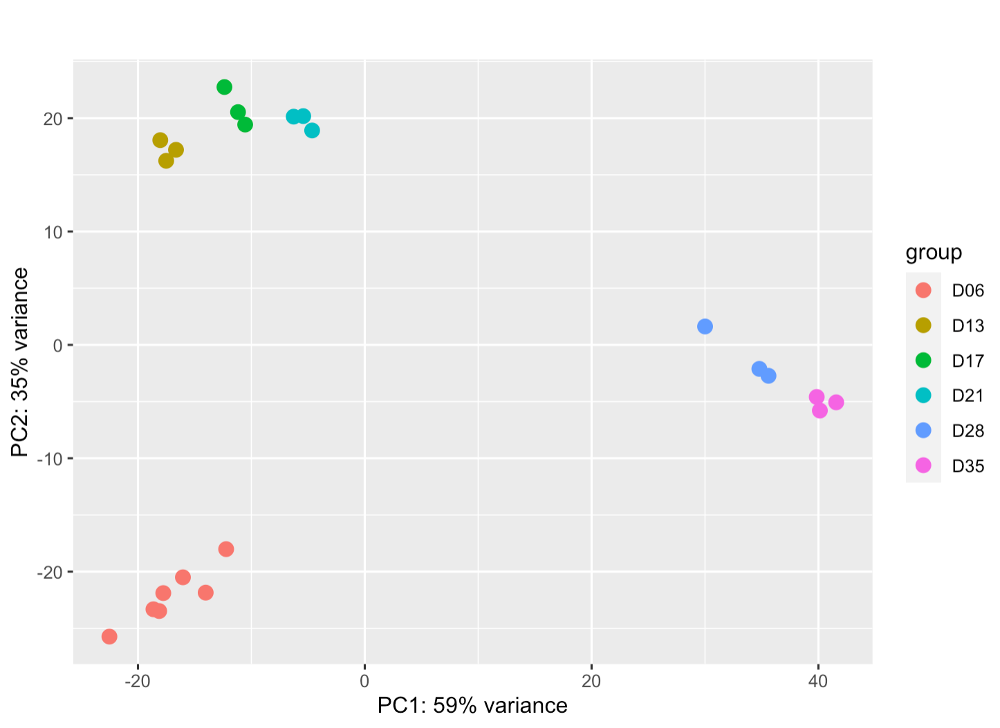

**Figure 7.** PCA plot

Save the plot as shown on the RStudio window to PDF file using
`dev.copy()` function. `dev` mean device, and this refers to the
plotting space in your RStudio, as well as a new "device" that is opened
as a new file on your computer. Once the plotting to a new "device" is
done, we must do `dev.off()` to close the device so that the plot can be
viewed.

``` r
dev.copy(pdf, "PCA.pdf") # If we don't specify the location of the output file, it will be created in the current work directory. 
dev.off() 
# Visit the PCA.pdf in Ubuntu file browser to view your PDF file. 
# If you are not sure where you are right now (i.e. where the file was saved), try getwd() command in R. 
```

**Box 1: Saving graphic produced in RStudio** **Save as PDF**

``` r
# Name the file as you like it, but try to keep it meaningful.
# Other options we can define when exporting a plot, such as size
# Remember that text in R need to be inside a quotation mark - single quote or double quote is fine
dev.copy(pdf, "__________", width = 11, height = 7) 
dev.off()
```

**Save in other file format** The `...` in this R function represents
arguments that specify characteristics of output files. These arguments
could be `height =` `width =` `res = (resolution)` *For a jpg file*,
dimensions are defined in pixels. If you want A4 at 300 dpi, the
parameters would be height = 3508, width 2480, res = 300 *For pdf and ps
files* dimensions are in inches. For A4, it is height = 8.3, width =
11.7

To output R graphics into a file directly, first we run one of the
following commands to create a file of that type. Then run a command
that creates a plot, this will be plotted onto the file (device) we just
created. Then we do `dev.off()` to close the file so that it can be
viewed.

``` r
pdf(file = "filename.pdf", ...)  # see pdf() manual for more details of available settings. 
jpeg(filename = "filename.jpg", ...)
png(filename = "filename.png", ...)
postscript(file = "filename.ps", ...)

# For example
jpeg(filename = "top20.jpg", width = 800, height = 600)
pheatmap(top20_genes)
dev.off()
```

Remember to `dev.off()` or the file cannot be opened

The PCA plot can also be created differently; perhaps we want the data
points to be of different sizes or we want to represent different stages
of the worms using "shape" instead of "colour". We can use ggplot for
this.

``` r
# Produce a PCA plot and keep plot attributes and parameters to a new object called PCA
PCA <- plotPCA(rld, intgroup = c("condition"), returnData = TRUE)
percentVar <- round(100 * (attr(PCA, "percentVar")))

# Use the information to produced a more customisable PCA
# making data points and text larger
ggplot(PCA, aes(PC1, PC2, color=condition)) +
geom_point(size=5) +
xlab(paste0("PC1: ",percentVar[1]," % variance")) +
ylab(paste0("PC2: ", percentVar[2], "% variance")) +
theme(text = element_text(size = 15))

# represent different groups with shape instead of colour
ggplot(PCA, aes(PC1, PC2, shape=condition)) +
geom_point(size=5) +
xlab(paste0("PC1: ",percentVar[1]," % variance")) +
ylab(paste0("PC2: ", percentVar[2], "% variance")) +
theme(text = element_text(size = 15))
```

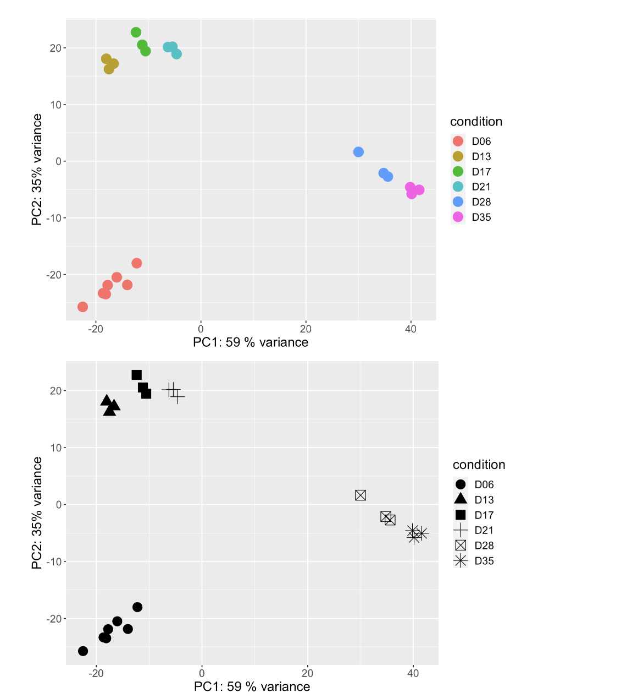

**Figure 8.** PCA plot produced by ggplot2

### Mini exercise

-   Try saving this plot into a file format of your choice
-   How could you specify the colour or shape that go with each group?
    (e.g. how would you tell R so that D06 group is shown in red, D13
    group is shown in orange). Try using Google to help you find the
    answer :)

### Distance matrix

In some cases, clustering of samples on PCA plots may not show whether
there is a clear distinction among the groups. On occasion, using
different types of clustering such as sample heatmap may help. To create
sample heatmap, we measure overall profiles and relationship between
samples using a distance matrix. We will create a distance matrix (using
`dist()` function) from normalised and log-transformed reads (the `rld`
object created earlier using `rlogTransformation` command), and then
visualise it on a heatmap.

The `rld` object has a few attributes. We use function `assay()` to
extract just the number matrix, which is a required input for the `t()`
(transpose) and `dist()` functions.

``` r
# Create a distance matrix between each sample
sampleDist <- dist(t(assay(rld)))
sampleDistMatrix <- as.matrix(sampleDist)

# Prepare annotation for the heatmap
rownames(sampleDistMatrix) <- rld$condition
colnames(sampleDistMatrix) <- NULL

# Set heatmap colour scheme
# colorRampPalette took the input (vector of colour codes), and interpolate that into a number of shades (in this case, we says 255)
# The following code means pick 9 colours from Blues palette. 
# brewer.pal is part of the RColorBrewer package that we load at the start of RStudio. 
colors <- colorRampPalette(rev(brewer.pal(9,"Blues")))(255)

# Create heatmap
pheatmap(sampleDistMatrix, clustering_distance_rows = sampleDist, clustering_distance_cols = sampleDist, color = colors)
```

This should output a plot similar to one below
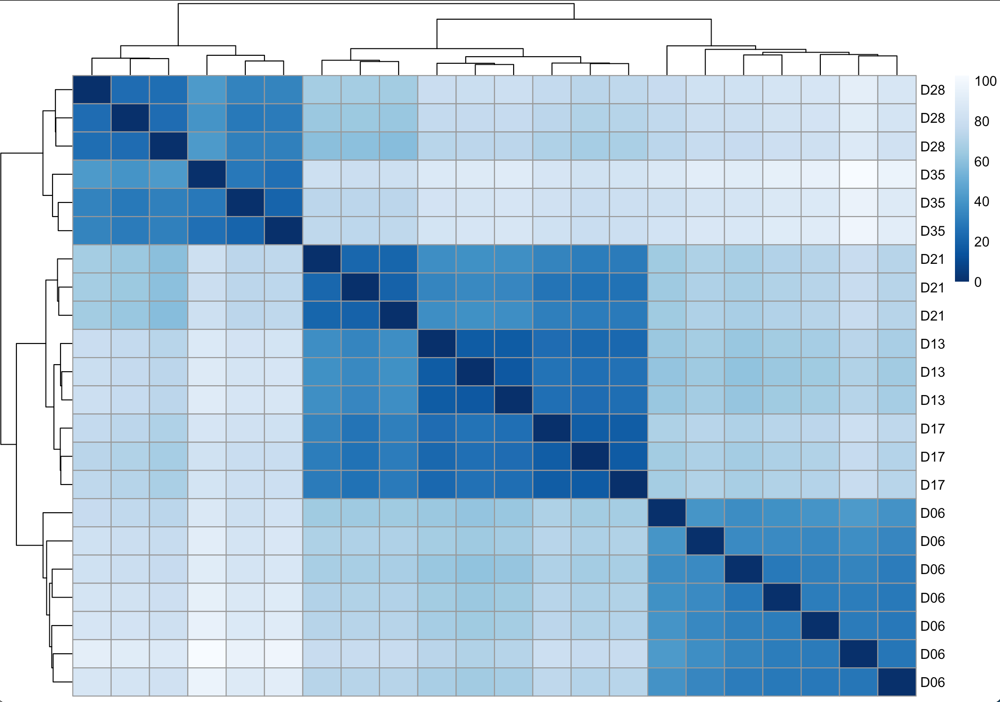

**Figure 9.** Sample heatmap

``` r
# Save the plot to a PDF file
dev.copy(pdf, "sampleheatmap.pdf", width = 6, height = 4)
dev.off()

# Alternatively, we can create a heatmap using an R internal heatmap function
heatmap(sampleDistMatrix, Rowv = sampleDist, Colv = sampleDist, cexRow = 0.7, labCol = FALSE)
```

[↥ **Back to top**](#top)

## Identifying differentially expressed genes 

Now that we have explored the overall relationship between samples based
on their transcriptome profiles, we can go deeper into the data and
explore differential gene expression - i.e. between
experimental/biological conditions.

At its core, differential expression analysis aims to identify
differences in gene expression between two or more groups, taking into
account one or more factors that may influence those differences. In
RNA-seq transcriptomic data, we often face challenges such as small
numbers of replicates, non-normally distributed data, and the need to
test thousands of genes simultaneously. As a result, the methods and
tools used for differential gene expression analysis involve specific
terminology and concepts—which we will now explore.

### Genes differentially expressed between conditions

Using the DESeq `dds` object we created earlier, we can look at the
differentially expressed genes using `results()` function. By default,
DESeq2 performs a pair-wise comparison of the first and the last
variable in the experimental design and provides a result table for this
comparison.

``` r
# Access result of differential expression analysis
res <- results(dds)
head(res)
```

The result table contains several columns, of which the most relevant
are: - Rowname, indicating gene id - Column 1: baseMean, average
expression level across all samples normalised by sequencing depth -
Column 2: log2FoldChange, in this table below, of D35 / D06 - Column 6:
padj, adjusted p-value, p-value corrected for multiple testing


**Figure 10.** Example of DESeq2 result table

### Log2 Fold Change

Fold change refers to the ratio of normalised read counts between two
conditions. To better visualise differences in gene expression, this
ratio is often converted to a log base 2 scale—known as the log2 fold
change (log2FC). This transformation helps balance the scale for up- and
down-regulated genes, and becomes intuitive with practice: a log2FC of 1
means the gene’s expression has doubled, while a negative log2FC
indicates down-regulation.

### P-values, Q-values, and the Multiple Testing Problem

When analysing a single gene, a p-value below a chosen threshold (e.g.,
0.05) suggests a statistically significant difference, meaning there is
only a 5% chance the result is due to random variation. However, in
transcriptomics, we often test thousands of genes simultaneously—say,
10,000—which would yield about 500 false positives if each were tested
at p = 0.05. This is known as the multiple testing problem.

To correct for this, we use adjusted p-values, also known as q-values,
which take into account the number of comparisons being made. Most
RNA-seq analysis tools, such as DESeq2, automatically calculate these
adjusted values. When identifying differentially expressed (DE) genes,
it is standard to use a q-value threshold (e.g., q \< 0.05) rather than
the raw p-value.

### Choosing a Cut-off for Differential Expression

In this manual, we define differentially expressed genes as those with a
log2 fold change greater than 1 or less than -1—meaning at least a
twofold increase or decrease in expression.

You may adjust this threshold depending on your data:

-   Stricter cut-off (e.g., \|log2FC\| \> 3) reduces false positives,
    especially in datasets with fewer replicates or lower sequencing
    depth.

-   Lower cut-off (e.g., \|log2FC\| \> 0.5) may be appropriate when the
    expected changes are subtle or only affect a subset of cells in the
    population, diluting the overall signal.

## Compare gene expression between 2 conditions

Using the same `results()` command, with additional arguments, we can
explore pair-wise comparison between any two given groups of samples.
For example, we may be interested in differences between day-13 and
day-6 worms. We can use the commands below.

Using `contrast()`, we can specify groups of samples to be compared.
Notice the order by which the condition names are mentioned for the
`contrast`; this example means `D06` is *denominator* in the log2 fold
change calculation.

``` r
# Create a results table for D13 vs D06
# alpha = 0.01 specify the adjusted p-value cut off to use when summary() function count the number of differentially expressed genes
res_D13D06 <- results(dds, contrast = c("condition", "D13", "D06"), test = "Wald", alpha = 0.01) 

summary(res_D13D06, alpha = 0.01)

# Explore top-20 differentially expressed genes based on adjusted p-value
res_D13D06[order(res_D13D06$padj),][1:20,]

# To look at genes that were up-regulated in day-13 worms
# The which function returns positions where the condition is TRUE?
# Because we are looking at genes with higher expression in day-13 group, which is the numerator, log2FC will be positive. We could use cut-off of log2FC > 1 & padj < 0.01
res_D13D06[which(res_D13D06$log2FoldChange > 1 & res_D13D06$padj < 0.01),]
```

### Exercise 2

Look at the result of differential gene expression analysis between
day-13 and day-6 worms.

1)  How many genes are up-regulated in day-13 worms compared to day-6
    worms?

2)  How many genes are up-regulated in day-6 worms?

3)  Try using WormBaseParaSite to explore some of the top differentially
    expressed genes ranked by log2FC.
    
4)  Your collaborators say that they have run the same analysis, ''filtering'' for \|log2FC\| \> 1 and adjusted p-value \< 0.01 but did not get the same results. You ask to see the code they wrote (below). Can you explain why the two sets of results differ? 

``` r
# Create my own results table for D13 vs D06
# alpha = 0.01 specify the adjusted p-value cut off to use when summary() function count the number of differentially expressed genes
res_D13D06 <- results(dds, contrast = c("condition", "D13", "D06"), lfcThreshold = 1 , test = "Wald", alpha = 0.01) 
```


[↥ **Back to top**](#top)


## Exploring gene expression using gene plots and heatmaps

We have looked at the results of pairwise comparison so far in form of
large tables with multiple columns and thousands of rows, representing
all genes in the *S. mansoni* annotation we used. This information can
be visualised using **MA plots** (log2FC and baseMean expression level shown
on log scale) and **volcano plots** (log2FC and adjusted p-value). We
can also plot expression of a particular gene across all samples.

**MA plot**

``` r
# We can use plotMA() function which come with DESeq2 package
plotMA(res_D13D06)

# The upward- and downward-pointing triangles indicate that there are data points beyond the axis limits of this plot. We can adjust the plotting parameters to put those points in the plot. 
plotMA(res_D13D06, ylim = c(-13,8))

# Also, we make the plot easier to read and more complete by adding titles and axis labels, and set a new size for each data point. 
plotMA(res_D13D06, ylim = c(-13,8), main = "log2 fold changes day-13 VS day-6 S. mansoni", ylab = expression(paste(log[2],' fold change')), cex = 0.75)

# We might want to draw lines on the plot to mark the -1 and 1 cut-off for log2FC
abline(h = c(-1,1))
```


**Figure 11.** MA plot

**Volcano plot**

``` r
# We will use the result table from pair-wise comparison between D13 vs D06
res_D13D06

# Make input readable for ggplot
res_D13D06_df <- as.data.frame(res_D13D06)

# Define threshold to mark genes with different colours
# We take the absolute value of log2FC to cover both up- and down-regulated genes
res_D13D06_df$threshold = as.factor(abs(res_D13D06_df$log2FoldChange) > 1 & res_D13D06_df$padj < 0.01)

# Create a volcano plot
ggplot(data=res_D13D06_df, aes(x=log2FoldChange, y=-log10(padj), colour=threshold)) +
geom_point(alpha=0.75, size=3) +
theme(legend.position="none", text = element_text(size = 15)) +
xlab(expression(paste(log[2],' fold change'))) +
ylab(expression(paste('-', log[10],' adjusted p-value'))) +
ggtitle("D13 VS D06")
```


**Figure 12.** Volcano plot

**Plot for an individual gene**

``` r
# Smp_022450.1 is a gene from the top-20 lowest adjusted p-val list 

# Use plotCounts which come with DESeq2 package
plotCounts(dds, "Smp_022450.1", intgroup = c("condition")) 

# Or use ggplot
data <- plotCounts(dds, "Smp_022450.1", intgroup = c("condition"), returnData = TRUE)
ggplot(data = data, aes(x = condition, y = count)) +
geom_point(position = position_jitter(width = 0.2, h = 0)) +
scale_y_continuous(trans = "log10") +
ggtitle("Smp_022450.1") 
```

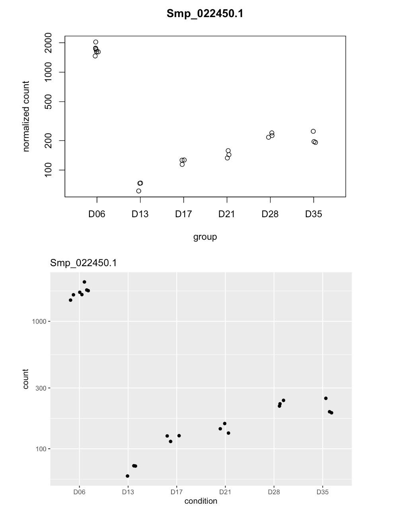

**Figure 13.** Gene plot

**Gene heatmap** We often want to examine the expression patterns of multiple genes at once. Heatmaps are a powerful and versatile way to do this, transforming tables of numerical data into an intuitive visual format. The input data might be normalised counts of top differentially expressed genes, genes involved in a specific biological pathway, or log2 fold change values instead of raw counts. Earlier, we used a heatmap to visualise the distance matrix between samples—but the same approach can be applied to explore gene expression profiles.

``` r
# Select genes with the top-20 lowest adjusted p-value
# Rank genes by their adjusted p-value (padj) 
# order() function returns the position indices of a vector (in this case res$padj) in sorted order, then we use these indices to call data from the dataframe
res_D13D06[order(res_D13D06$padj),]

# Take the top 20 genes from the ranked list
res_D13D06_top20 <- res_D13D06[order(res_D13D06$padj),][1:20,] 

# Take the gene IDs of the top 20 DE genes
res_D13D06_top20_genes <- rownames(res_D13D06_top20)

# Extract the rlog-transformed counts of the top 20 DE genes. 
# By using rlog-transformed counts,extreme values (either low or high) are shrunken and overall differences become clearer, which make the data suitable for visualisation and clustering (producing a heatmap involves clustering of rows and column).
# which() function returns positions where the condition is TRUE, in this case, the condition is rownames(assay(rld)) %in% res_top20_genes), (translation: rownames of the rld objects that match the list of top-20 genes) 
rld_res_D13D06_top20_genes <- assay(rld)[which(rownames(assay(rld)) %in% res_D13D06_top20_genes),]

# Create a heatmap using pheatmap
pheatmap(rld_res_D13D06_top20_genes)
```

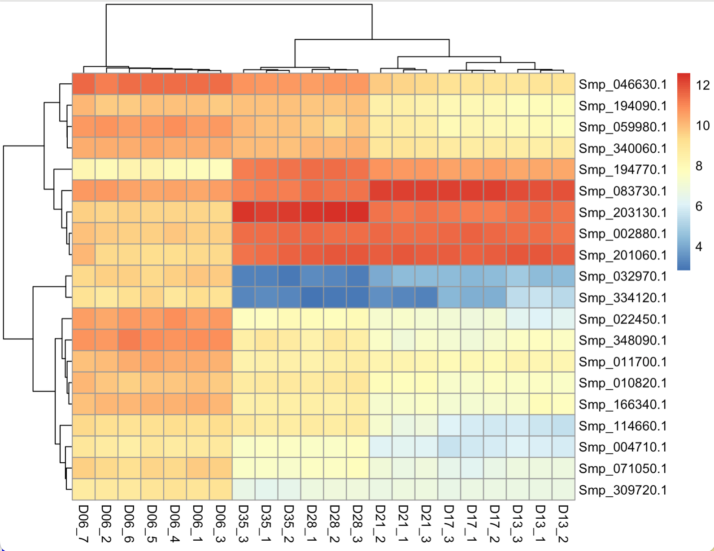

**Figure 14.** Heatmap - default setting

The default plot look quite messy. The rows are annotated with gene IDs,
and the labels overlap each other due to limited space. The column annotations
are also long and contain excess information.

**Customised heatmap**

``` r
# Define how columns will be labelled
colann <- c(rep("day-6",7), rep("day-13",3), rep("day-17",3), rep("day-21",3), rep("day-28",3), rep("day-35",3))  

# Create a heatmap
# To see other palette options, run this command display.brewer.all(n=NULL, type="all")
# To see information such as the number of colours, colourblind compatibility, run  brewer.pal.info()
pheatmap(rld_res_D13D06_top20_genes,
color = colorRampPalette(rev(brewer.pal(9, "RdYlBu")))(100),
border_color = NA,
show_rownames = TRUE,
show_colnames = TRUE,
labels_col = colann,
cluster_cols = TRUE,
cellwidth = 15,
fontsize = 10,
main = "Top 20 DE genes: day-13 / day-6")
```

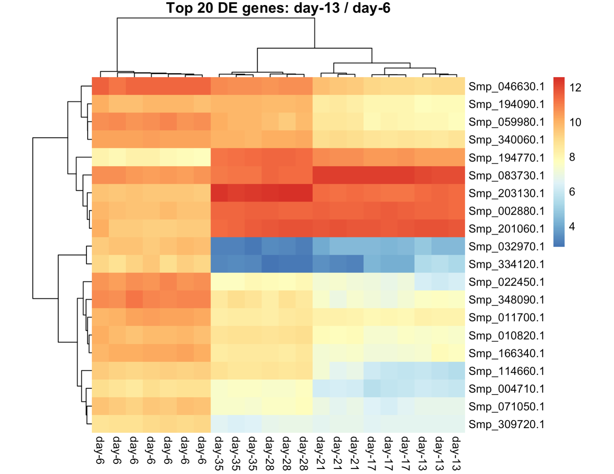

**Figure 15.** Heatmap - customised

### Exercise 3

1)  Compare the volcano plot or MA plot of D13vsD06 and D17vsD13 worms. What
    do you notice about the range of log2FC and adjusted p-values? It
    might be more informative to show plots from both comparison on the
    same axis ranges. Try using `ylim()` and `xlim()` argument to set
    the range of x and y axes.

2)  Select a gene from the top differentially expressed genes in the comparison
    D13vsD06 and produce a gene plot. Find out the product name of that
    gene and add it to the title of the gene plot.

[↥ **Back to top**](#top)

## Functional analysis using GO term enrichment

When conducting experiments, we often start with hypotheses about which genes might be differentially expressed between conditions or influenced by a specific treatment. Transcriptomic analysis, however, generates a vast amount of data. Rather than solely focusing on expected changes in particular genes, we can also take a data-driven approach—allowing patterns and trends in the results to reveal unexpected or novel findings.


### What to do with your lists of differentially expressed genes?

Interpreting transcriptomic results can be daunting. In some cases, you may find no significant differences—raising the question of whether this reflects true biology or simply noisy data (which can influence p-values). In others, you might see thousands of genes flagged as differentially expressed—leaving you wondering what to make of it all.

One option is to manually explore each gene, but this is time-consuming and subject to personal bias or limited prior knowledge. A more systematic approach is functional analysis, which leverages known annotations to identify biological themes in your data. You may already be familiar with methods such as GO enrichment analysis, gene set enrichment analysis, or pathway enrichment analysis.

In this session, we will demonstrate GO enrichment analysis using the topGO package in R ([Alexa et al., 2005](https://academic.oup.com/bioinformatics/article/22/13/1600/193669)), to see whether specific categories of genes are overrepresented among your differentially expressed genes. For some organisms, GO term annotations are already included in downloaded genome files. For helminths, you can access these annotations via BioMart on WormBase ParaSite, or extract them directly from a GFF file downloaded from the site. Alternatively, if no annotation is available, you can generate your own using tools such as Blast2GO ([Conesa et al., 2005](https://academic.oup.com/bioinformatics/article-lookup/doi/10.1093/bioinformatics/bti610)).

### Quick revision on GO term:

Genes can be associated with Gene Ontology (GO) terms, which describe characteristics such as a gene’s function, the biological processes it participates in, or the cellular component it is linked to. These terms may be assigned based on sequence similarity, experimental evidence, homology, or computational prediction.

When performing GO term enrichment analysis, we are essentially asking: “Are certain GO terms overrepresented in my list of genes compared to what would be expected by chance?” This helps us identify biological themes or pathways that may be affected in our experiment.


### Common tools for GO enrichment analysis

-   topGO R package
-   goseq R package
-   [g:Profiler](https://biit.cs.ut.ee/gprofiler/gost)
-   [GOrilla](http://cbl-gorilla.cs.technion.ac.il/)
-   Gene Set Enrichment Analysis [GSEA](https://www.broadinstitute.org/gsea/index.jsp)
-   Ingenuity Pathway Analysis Studio (commercial software)

GO enrichment analysis tools available on online servers make it easier for researchers to perform analyses without needing extensive command-line or coding experience. However, these tools often have limited reference GO annotations, typically focusing on model organisms like human and mouse. An exception is g:Profiler, which integrates annotations from multiple genome databases, including WormBaseParaSite, making it a good option for a broader range of species.

For many non-model organisms, you may still need to download and run the software locally. Today, we’ll learn how to perform GO enrichment analysis using the R command line, to help you understand and customise the process. That said, you are encouraged to also explore g:Profiler and other web-based tools for additional functionality and ease of use.

### GO terms enrichment using topGO

Running topGO involves several steps (see the [topGO documentation](https://bioconductor.org/packages/release/bioc/html/topGO.html)). To simplify this process, we’ve provided a wrapper script called run_topGO.R, which combines all the steps into a single command. This script also enhances the standard topGO output by adding an extra column listing the gene IDs contributing to each enriched GO term.

To get started, open your Terminal and download run_topGO.R from the course GitHub repository.


``` bash
cd /home/manager/Transcriptomics/
wget https://raw.githubusercontent.com/WCSCourses/Helminth_Bioinformatics_2025/main/course_modules_2025/module_transcriptomics/run_topGO.R
```

Move back into RStudio

``` r
# Load the R wrapper script for running topGO
source("/location/of/your/file/Transcriptomics/run_topGO.R")

# Collect ID of genes that were up-regulated in D13 (pass cut-off of padj < 0.01 and log2FC > 1)
D13D06_upinD13 <- rownames(res_D13D06)[which(res_D13D06$padj < 0.01 & res_D13D06$log2FoldChange > 1)]

# Check how many genes there are
length(D13D06_upinD13) 
```

``` r
# Before Run topGo
# Make topGO reference file
GOref <- read.delim("/location/of/your/file/Transcriptomics/References_v10/Sm_v10_GOref.txt", header = FALSE)
head(GOref) 
colnames(GOref) <- c("Gene.stable.ID", "GO.term.accession")

# Prepare a new dataframe 
GOref2 <- data.frame(matrix(ncol = 2))
colnames(GOref2) <- c("GeneID","GO")

# Aggregate GO terms from the same gene ID into one row
for (i in unique(GOref$Gene.stable.ID)) {
GOref2 <- rbind(GOref2,
c(i,paste(GOref$GO.term.accession[which(GOref$Gene.stable.ID == i)], collapse = ",")))
}

head(GOref2)

# Remove the first row which contain NA
GOref2 <- GOref2[-1,]

# For genes with no GO term, assign a dot (.) in the GO column
GOref2[grep("GO", GOref2$GO, fixed = TRUE, invert = TRUE),2] <- "."

# Output the re-formatted GO reference to a file
write.table(GOref2, file = "GO_annotation_Smv10.tsv", quote = FALSE, sep = "\t", col.names = FALSE, row.names = FALSE)

# Run topGO
# The input required for running topGO are: 
# - reference GO annotation (GO terms associated with each gene)
# - list of genes to test for GO enrichment
# - threshold for calling “significant” enrichment
topGO_D13D06_upinD13  <- run_topGO_R(ref = "/FULL_PATH/Transcriptomics/GO_annotation_Smv10.tsv", genelist = D13D06_upinD13, thres = 0.05)

# Check topGO result. Column 1 to 7 are standard topGO output; column 8 give a list of input genes with that GO term. We won’t look at that at the moment. 
topGO_D13D06_upinD13[,1:7]
```

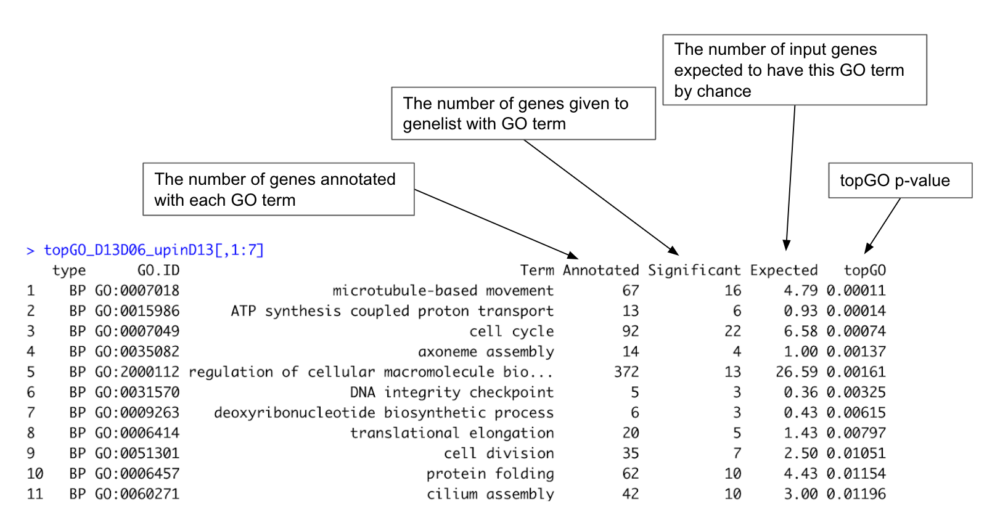

**Figure 16.** Example of topGO result

### Exercise 4

1)  Run topGO using genes that were **up-regulated in day-6 worms**,
    compared to day-13 worms ()

2)  What do we notice about differences in day-6 and day-13 worms
    according to the GO enrichment?

3)  What genes are responsible for the enrichment of the top GO term
    (see column 8 of the topGO result)? Try using WormBaseParaSites and
    other databases to gain more information about those genes and GO
    term.

### Other ways to inspect your RNA-seq data

Now that you’ve completed differential expression and functional enrichment analyses, what else can you explore? Here are some useful next steps for inspecting and interpreting your transcriptome data:

-   Perform sanity checks. Are there any results that seem unexpected or implausible? Are these surprises biologically meaningful or could they be due to noise or confounding in your experimental design?
-   Compare with phenotype. Do your gene expression results align with the observed phenotype or morphological differences?
-   Cross-validate with other tools. Do results from different differential expression tools agree?
-   Refer to prior data. Are your findings consistent with previous results from microarrays, qRT-PCR, or other transcriptomic studies?
-   Form new hypotheses. Use your data as a foundation to develop new hypotheses. Test them with alternative analysis methods, follow-up experiments, or further literature review.


### Making use of existing transcriptome data

Transcriptome experiments are often known to be expensive and not very
affordable. Here are some databases of existing transcriptomic data and
how some research have made use of them.

**Databases of transcriptomics data** - Gene expression omnibus
(<https://www.ncbi.nlm.nih.gov/geo/>) - ArrayExpress
(<https://www.ebi.ac.uk/arrayexpress/>) - Expression Atlas
(<https://www.ebi.ac.uk/gxa/home>)

**Example of RNA-seq data reuse:** - This paper looked at data from
published RNA-seq experiments and revealed that some of the cells were
contaminated with Mycoplasma (PMID: 25712092). - This paper used
existing RNA-seq data with some new data to study specific gene
expression on Z and W chromosome of schistosomes (PMID: 30044216).

### Further resources

**RNA-seq data analysis guide** - This publication from [Conesa *et al*.
2016](https://genomebiology.biomedcentral.com/articles/10.1186/s13059-016-0881-8)
is still widely relevant for the design of RNA-seq experiments.

-   Hands-on tutorial on RNA-seq data analysis:
    <https://galaxyproject.github.io/training-material/topics/transcriptomics/tutorials/ref-based/tutorial.html>\
-   News and update on RNA-seq: www.rna-seqblog.com
-   If you are really interested in statistics behind DE analysis:
    <http://www.nathalievialaneix.eu/doc/pdf/tutorial-rnaseq.pdf>
-   If you need a gentle (and step-by-step) guide to a particular
    statistic technical terms:
    <https://www.youtube.com/user/joshstarmer>

**Databases of your organisms** 

-    WormBaseParaSite
(<https://parasite.wormbase.org/index.html>)
-    WormbaseDB
(<https://wormbase.org/#012-34-5>)
-    Ensembl
(<http://asia.ensembl.org/index.html>)
-    EupathDB
(<https://eupathdb.org/eupathdb/>)
-    GenBank
(<https://www.ncbi.nlm.nih.gov/genome>)
-    UCSC
(<http://hgdownload.soe.ucsc.edu/downloads.html>) (GO terms associated
with genes are often provide together with genome annotation)

**Databases of pathway and pathway analysis**

-    Reactome
(<https://reactome.org/>) - KEGG (<https://www.genome.jp/kegg/>) -
InnateDB (<http://www.innatedb.com/>)
-    InterproScan
(<https://www.ebi.ac.uk/interpro/search/sequence-search>)

[↥ **Back to top**](#top)
